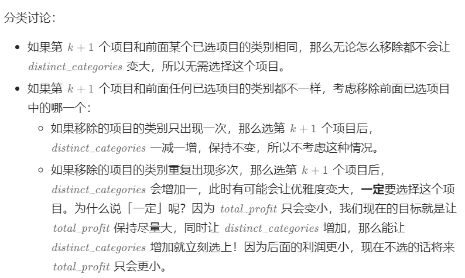
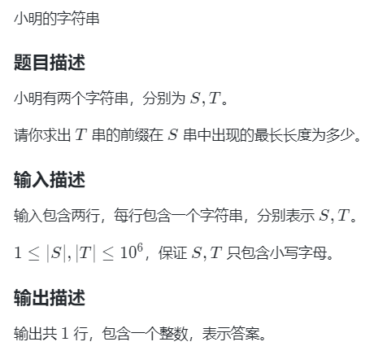

## 细节


### 23lqb省赛


#### 反异或01串


蓝桥杯2023真题

思维、回文串、马拉车

本题暴力拿50%

思维难度大

https://www.lanqiao.cn/problems/5003/learning/?subject_code=2&group_code=6&match_num=14&match_flow=1&origin=cup

```
import java.util.*;

public class Main {
    static int INF = 0x3f3f3f3f;
    static int n,m;
    static long ans;
    
    public static void main(String[] args) {
        Scanner sc = new Scanner(System.in);
        //思维 + 回文字符串，正解是马拉车算法
    //思考反转异或操作有什么用？
    //如 0001，反转异或后变成1001，也就是1翻倍了，从而让初始少了1个1
    //此外，反转异或后s':变成了回文串了
    //所以，只要找到T中回文子串的最大1的个数cnt2，cnt2/2就是省去的个数
    //ans = cnt1 / (cnt2/2), cnt1是T中1的个数
    //注意：如果是奇数子串，中心必须是'0'才进行讨论
    //异或：相异得1，所以只要1个1就能变成2个1
    //反转：要求s'回文
        char[] t = sc.next().toCharArray();
    n = t.length;
    int mx = 0,s = 0;
        //计算所有回文子串中1的个数的最大值
    for(int i=0;i<n;i++){//枚举中心
      //奇数长度子串
      int cnt = 0;
      if(t[i]=='0'){
        for(int j=1;i-j>=0 && i+j<n;j++){
          if(t[i-j]!=t[i+j])
            break;
          if(t[i-j]=='1') cnt ++;
        }
        mx = Math.max(mx,cnt);
      }
        
      //偶数长度,右中心
      cnt = 0;
      for(int j=i-1,k=i;j>=0 && k<n;j-=1,k+=1){
          if(t[j]!=t[k])
            break;
          if(t[j]=='1') cnt ++;
        }
      mx = Math.max(mx,cnt);
      
      if(t[i]=='1') s += 1;
    }
    
    System.out.println(s - mx);
    }
}
```


#### 互质数的个数


https://www.lanqiao.cn/problems/3522/learning/?subject_code=2&group_code=6&match_num=14&match_flow=1&origin=cup

本题比赛时候写了欧拉函数，但是还是拿的暴力分，因为不能直接对a^b求快速幂，因为Mod是对方案个数求模，而不是对值求模。

正确答案：ans = Euler(a)  * qpow(a,b-1,Mod)


Eular(a^b) = a^b * ( /p*(p-1) ......)  = a^(b-1)  * Eular(a)

推导：Eular(a^b) = Eular(a * a^(b-1)) = a

```
MOD = 998244353

a, b = map(int, input().split())
if a == 1:
    print(0)
    exit(0)

def qpow(x, n):
    res = 1
    while n:
        if n & 1:
            res = res * x % MOD
        x = x * x % MOD
        n >>= 1
    return res

def euler(x):
    res = x
    for i in range(2, int(x ** 0.5) + 1):
        if x % i == 0:
            while x % i == 0:
                x //= i
            res = res // i * (i - 1)
    if x > 1:
        res = res // x * (x - 1)
    return res

print(qpow(a, b - 1) * euler(a) % MOD)
```


#### 小蓝的旅游计划


> https://www.lanqiao.cn/problems/3534/learning/?subject_code=2&group_code=5&match_num=14&match_flow=1&origin=cup
>
> 本题可以用dp做，时间O（n^3）
>
> 用堆做
>
> 如果没有油箱的限制，是一道经典的堆的题目，
>
> 有了邮箱的限制，需要再多一维，维护来的时候的油箱容量。

方法1：堆+线段树

https://blog.csdn.net/m0_62573287/article/details/130428871

方法2：堆

维护的Node包含三个信息：

//price这个地点的油价格
  //l：这个地点还能加这么多油
  //prem：刚到达这个节点时的油量（不算这个地方加的油），这个变量目的是因为油箱上限是m。

```
import java.util.*;
import java.io.*;
import java.math.*;

public class Main {
	static int INF = 0x3f3f3f3f;
	static int N = 201000,M = 2*N;
	static int n,m;
	static long ans;
  static int[] dist = new int[N],cost = new int[N],lost = new int[N];
	
	public static void main(String[] args) {
		Scanner sc = new Scanner(System.in);
		
		n = sc.nextInt();
		m = sc.nextInt();
		for(int i=1;i<=n;i++) {
			dist[i] = sc.nextInt();
      cost[i] = sc.nextInt();
      lost[i] = sc.nextInt();
		}
    PriorityQueue<Node> q = new PriorityQueue<Node>((a,b)->(a.price-b.price));
    int curm = m;//油箱打小
    
    for(int i=1;i<=n;i++){
      if(dist[i]>m){
        System.out.println("-1");
        return;
      }

      //当前油量不够到达i,再买一点油
      while (q.size()>0 && curm<dist[i]){
        //买油
        Node t = q.poll();
        //这个节点能买到最多这么多油，m-剩下的油
        int now_mx_m = Math.min(t.l,m-t.prem);
        //当前需要加多少油
        int add_m = 0;
        //够节点i用了，选择部分。否则全选
        if(now_mx_m >= dist[i]-curm)
          add_m = dist[i]-curm;
        else add_m = now_mx_m;
        ans += (long)add_m * t.price;
        t.l -= add_m;
        curm += add_m;
        if(t.l>0){
          q.add(new Node(t.price,t.l,t.prem));
        }
      }
      //现在油够用了
      curm -= dist[i];
      q.add(new Node(cost[i],lost[i],curm));
    }
    System.out.println(ans);
    
	}
}
class Node{
  //price这个地点的油价格
  //l：这个地点还能加这么多油
  //prem：刚到达这个节点时的油量（不算这个地方加的油），这个变量目的是因为油箱上限是m。
  int price,l,prem;
  Node(int a,int b,int c){
    price = a;
    l = b;
    prem = c;
  }
}
```


#### 阶乘的和


https://www.lanqiao.cn/problems/3527/learning/?subject_code=2&group_code=5&match_num=14&match_flow=1&origin=cup&page=1

数学、思维

4个3！才能凑出4!。

8个3！也能凑出4！。

```
import java.util.*;
import java.io.*;
import java.math.*;

public class Main {
	static int INF = 0x3f3f3f3f;
	static int N = 101000,M = 2*N;
	static int[] arr = new int[N];
	static int n,m;
	static long ans;
	//首先找到mi = min(arr)，因为是公因数,一定 m>=mi
  //然后从mi开始枚举，知道找不到为止
  //具体的，当mi = 3时，当a中3的个数有4个才能凑出4。4*3！== 4！
	public static void main(String[] args) {
		Scanner sc = new Scanner(System.in);
		
		n = sc.nextInt();
    int mi = INF;
    HashMap<Integer,Integer> mp = new HashMap<>();
		for(int i=1;i<=n;i++) {
			arr[i] = sc.nextInt();
      mi = Math.min(mi,arr[i]);
      mp.put(arr[i],mp.getOrDefault(arr[i],0)+1);
		}
    int i;
    int jin = 0;//进位
    for(i=mi;;i++){
      int v = mp.getOrDefault(i,0);
      int cnt = v+jin;
      //如果i！的个数能凑出i+1
      if(cnt!=0 && cnt%(i+1)==0){
        jin = (v+jin)/(i+1); //进位贡献
        continue;
      }
      else break;
    }
    System.out.println(i);
	}
}
```


#### 蜗牛


https://www.lanqiao.cn/problems/4985/learning/?page=1&first_category_id=1&second_category_id=3&sort=problem_id&asc=0

状态机dp，感觉题目不严谨，没说X是递增的，也没说坐标会不会是负的


```java
import java.util.*;
import java.io.*;
import java.math.*;

public class Main {
	static int INF = Integer.MAX_VALUE;
	static int N = 101000,M = 2*N;
	static int[] x = new int[N];
  static int[] a = new int[N],b = new int[N];
  static double[][] dp = new double[N][2];
	static int n,m;
	static double ans;
	//状态机
  //dp[i][0]表示节点(i,0)的最小值
  //dp[i][1]表示当前杆子上传送起点位置的最小值：节点(i,a[i])的最小值
  //需要两个状态，所以是状态机，否则就是背包
  //关键点：每个杆子i上有两个点，一个是i-1传送到达点b[i]，一个是传送至i+1的起点a[i]
	public static void main(String[] args) {
		Scanner sc = new Scanner(System.in);
		
		n = sc.nextInt();
		for(int i=1;i<=n;i++) {
			x[i] = sc.nextInt();
		}
    for(int i=1;i<=n-1;i++) {
      a[i] = sc.nextInt();b[i+1] = sc.nextInt();
    }
    //初始没有杆子
    dp[0][1] = INF;
    
    for(int i=1;i<=n;i++) {
      dp[i][0] = Math.min(dp[i-1][0] + x[i]-x[i-1], dp[i-1][1] + b[i]/1.3);
      //在杆子上需要判断是向下还是向上
      dp[i][1] = Math.min(dp[i-1][1] + Math.abs(b[i]-a[i]) /(a[i]>b[i]?0.7:1.3),dp[i-1][0]+x[i]-x[i-1]+a[i]/0.7);
      // System.out.println(i+" "+dp[i][0]);
    }
    System.out.printf("%.2f",dp[n][0]);
	}
}
```


#### 彩色二叉树


- **完全二叉树的特征：树的高度是logn，节点x的子节点是2x、2x+1，x**的父节点是x/2。n=10****6****时，树的深度小于40。** 

- 关键点：这样每一次操作都是只遍历所有父亲节点

- **例如a，b的公共祖先是u，修改a时，若u也在a的修改范围内，那么****在u上记录修改，且修改距离减1。查询b时，查询u即可，若b在u的修改距离之内，那么b和u的颜色一致。 


## 贡献

https://codeforces.com/problemset/problem/608/B

> 输入长度均 ≤2e5 的字符串 s 和 t，只包含 '0' 和 '1'。并且 t 的长度大于等于 s 的长度。
>
> 定义 D(a,b) = |a[0]-b[0]| + |a[1]-b[1]| + ... + |a[n-1]-b[n-1]|。
> 例如 D("0011", "0110") = |0-0| + |0-1| + |1-1| + |1-0| = 0 + 1 + 0 + 1 = 2。
>
> 设 s 的长度为 n，对于 t 的所有长为 n 的连续子串 t'，计算 D(s,t')。输出所有 D(s,t') 的和。

【灵茶の试炼】题目&题解https://docs.qq.com/sheet/DWGFoRGVZRmxNaXFz

贡献 + 前缀和 + 推公式

```
import java.util.*;
import java.io.*;
import java.math.*;

public class Main {
	static int INF = Integer.MAX_VALUE;
	static int mod = 1000000007 ;
	static int N = 201000,M = 25;
	static int[] s = new int[N];
	static char[] a,b;
	static long ans = 0;
	static int n,m;
	
	static int query(int l,int r){
	    return s[r]-s[l-1];
	}

	public static void main(String[] args) throws IOException {
		
		a = (" "+sc.next()).toCharArray();
		b = (" "+sc.next()).toCharArray();
		n = a.length-1;
		m = b.length-1;
		for(int i=1;i<=m;i++){
		    s[i] = s[i-1] + (b[i]-'0');
		}
		for(int i=1;i<=n;i++){
		    if (a[i]=='0'){//找b的1
		        ans += query(i,m-n+i);
		    }else{
		        ans += m-n+1 - query(i,m-n+i);
		    }
		}

        System.out.println(ans);
		
	}

	static Scanner sc = new Scanner(System.in);

}

```


## 哈希表

#### [3153. 所有数对中数位不同之和](https://leetcode.cn/problems/sum-of-digit-differences-of-all-pairs/)

> 车尔尼有一个数组 `nums` ，它只包含 **正** 整数，所有正整数的数位长度都 **相同** 。
>
> 两个整数的 **数位不同** 指的是两个整数 **相同** 位置上不同数字的数目。
>
> 请车尔尼返回 `nums` 中 **所有** 整数对里，**数位不同之和。**
>
> - `2 <= nums.length <= 105`

求n^2个数对的不同数位和，贡献法

枚举每个数，考虑这个数作为数对的第二个元素时的元素，用哈希表维护前面所有的数，并且还要维护所有位的每个数的个数。

依次枚举每一个数,枚举到第i个数，再枚举这个数的每一位，对于某一位j，前面i-1个数的第j位中，与s[i]的第j位相同的个数是mp[s[i]]，所以以i为右端点时的答案的贡献就是i-1 - mp[s[i]]

```
class Solution:
    def sumDigitDifferences(self, nums: List[int]) -> int:
        n = len(nums)
        m = len(str(nums[0]))
        mp = Counter()
        ans = 0
        for i in range(n):
            s = str(nums[i])
            for j in range(m):
                # mp[key]：前i个数中第j位是s[j]的个数
                key = str(j) + s[j]
                ans += i - mp[key]
                mp[key] += 1     
        return ans
```


## 前缀和


#### [3152. 特殊数组 II](https://leetcode.cn/problems/special-array-ii/)（隐藏的很深，想不到就会用线段树

> 如果数组的每一对相邻元素都是两个奇偶性不同的数字，则该数组被认为是一个 **特殊数组** 。
>
> 周洋哥有一个整数数组 `nums` 和一个二维整数矩阵 `queries`，对于 `queries[i] = [fromi, toi]`，请你帮助周洋哥检查子数组 `nums[fromi..toi]` 是不是一个 **特殊数组** 。
>
> 返回布尔数组 `answer`，如果 `nums[fromi..toi]` 是特殊数组，则 `answer[i]` 为 `true` ，否则，`answer[i]` 为 `false` 。
>
> - `1 <= nums.length <= 105`
> - `1 <= nums[i] <= 105`

本题不容易想到要用前缀和，很多人用线段树做的，我比赛用的哈希表+双指针

- 前缀和

  构建原数组a：用于记录a[i]与a[i+1]奇偶关系（如果nums[i]%2 == nums[i+1]%2 则a[i] = 1 否则0）

  求前缀和：查询子数组中是否有同奇偶的相邻元素

  ```
  class Solution:
      def isArraySpecial(self, nums: List[int], queries: List[List[int]]) -> List[bool]:
          n = len(nums)
          s = [0]*n
          # 如果nums[i]%2 == nums[i+1]%2 则s[i] = 1 否则0
          for i in range(n-1):
              s[i] = 1 if nums[i]%2 == nums[i+1]%2 else 0
              s[i] += s[i-1]
          ans = []
          for a,b in queries:
              ans.append(True if s[b-1] - s[a-1]==0 else False)   
          return ans
          
  ```

  

- 双指针+哈希表

  数组维护左右最远满足条件的下标

  ```
  class Solution:
      def isArraySpecial(self, nums: List[int], queries: List[List[int]]) -> List[bool]:
          n = len(nums)
          i,j = 0,0
          # mil[idx]表示下标idx向左的最小下标
          mil = Counter()
          mar = Counter()
          while i<n:
              j = i+1
              while j<n and nums[j]%2 != nums[j-1]%2:
                  mil[j-1] = i
                  j += 1
              # (i,j-1)
              mil[i] = i
              mar[i] = j-1
              k = i+1
              while k<n and nums[k]%2 != nums[k-1]%2:
                  mar[k] = j-1
                  k += 1
              i = j
          ans = []
          for a,b in queries:
              ans.append(mar[a]>=b and mil[b]<=a )
          return ans
      
  ```

  

## 爆搜

### 分糖果


https://www.lanqiao.cn/problems/4124/learning/?page=1&first_category_id=1&second_category_id=3&sort=problem_id&asc=0

```
import java.util.*;
import java.io.*;
import java.math.*;

public class Main {
	static int INF = Integer.MAX_VALUE;
	static int N = 101000,M = 2*N;
	static int n,m;
	static long ans;
	static void dfs(int u,int x,int y){
    if(u>=n){
      if(x==0 && y==0)
        ans += 1;
      return;
    }
    for(int i=0;i<=x;i++){
      for(int j=0;j<=y;j++){
        if(i+j>=2 && i+j<=5)
          dfs(u+1,x-i,y-j);
      }
    }
  }
	public static void main(String[] args) {
		Scanner sc = new Scanner(System.in);
		n = 7;
		dfs(0,9,16);
    System.out.println(ans);
	}
}
```

#### [连续数组]()


> n=10，30%
>
> n=15，100%

24真题，爆搜+剪枝，也可以用状态压缩dp

- 方法1：爆搜+剪枝

```
import java.util.*;
import java.io.*;
import java.math.*;

public class Main {
	static int INF = Integer.MAX_VALUE;
	static int mod = 1000000007 ;
	static int N = 30,M = 2*N;
	static int[] op = new int[N],select = new int[N],vis = new int[N];
	static int n,m;
	static long ans;
	
	static void dfs(int u) {
		if(u>n) {
			// for(int i=1;i<=n;i++) System.out.print(select[i]+" ");
			// System.out.println();
			ans ++;
			return;
		}
		if(op[u-1]==1) {
			int val = select[u-1]+1;
			if(vis[val]==0 && val<=n) {
				select[u] = val;
				vis[val] = 1;
				dfs(u+1);
				vis[val] = 0;
			}
			
		}else {
			for(int i=1;i<=n;i++) {
				if(vis[i]==1 || select[u-1]+1==i) continue;
				select[u] = i;
				vis[i] = 1;
				dfs(u+1);
				vis[i] = 0;
			}
		}
	}

	public static void main(String[] args) throws IOException {
		
		n = sc.nextInt();
		
		for(int i=1;i<=n-1;i++) {
			op[i] = sc.nextInt();
		}
		for(int i=1;i<=n;i++) {
			Arrays.fill(vis, 0);
			vis[i] = 1;
			select[1] = i;
			dfs(2);
			vis[i] = 0;
		}
		System.out.println(ans);
	}
	static Scanner sc = new Scanner(System.in);

}
```

- 方法2：状态压缩dp

```


import java.util.*;
import java.io.*;
import java.math.*;

public class Main {
	static int INF = Integer.MAX_VALUE;
	static int mod = 1000000007 ;
	static int N = 20,M = 2*N;
	static int[] op = new int[N];
  static long[][] dp = new long[1<<N][N];
	static int n;
	static long ans;
	
  static void solve(){
    for(int i=0;i<n;i++){
      dp[1<<i][i] = 1;
    }
    for(int mask = 0;mask<(1<<n);mask++){
      int i = getCnt(mask);
      for(int last = 0;last<n;last++){
        if((mask>>last&1)==0 ) continue;
        for(int j = 0;j<n;j++){
          if((mask>>j&1)==0 || j==last) continue;
          int cha = last - j;
          if(op[i-1]==1 && cha!=1) continue;
          if(op[i-1]==0 && cha==1) continue;
          dp[mask][last] += dp[mask & ~(1<<last)][j];
        }
        if(mask == (1<<n)-1) ans += dp[mask][last];
      }
    }
  }
  static int getCnt(int mask){
    int res = 0;
    while(mask>0){
      res += 1;
      mask -= mask&-mask;
    }
    return res;
  }
	public static void main(String[] args) throws IOException {
		
		n = sc.nextInt();
		
		for(int i=1;i<=n-1;i++) 
			op[i] = sc.nextInt();
		
		solve();
		System.out.println(ans);
	}
	static Scanner sc = new Scanner(System.in);

}
```


### 有两个DFS的程序，后dfs中的数组一定要重置

或者定义在局部

[1617. 统计子树中城市之间最大距离](https://leetcode.cn/problems/count-subtrees-with-max-distance-between-cities/)（树形dp）


### 集合容器嵌套

#### [2349. 设计数字容器系统](https://leetcode.cn/problems/design-a-number-container-system/)

> 设计一个数字容器系统，可以实现以下功能：
>
> - 在系统中给定下标处 **插入** 或者 **替换** 一个数字。
> - **返回** 系统中给定数字的最小下标。
>
> 请你实现一个 `NumberContainers` 类：
>
> - `NumberContainers()` 初始化数字容器系统。
> - `void change(int index, int number)` 在下标 `index` 处填入 `number` 。如果该下标 `index` 处已经有数字了，那么用 `number` 替换该数字。
> - `int find(int number)` 返回给定数字 `number` 在系统中的最小下标。如果系统中没有 `number` ，那么返回 `-1` 。

语法上，使用computeIfAbsent初始化内部集合并返回

- 方法1：哈希表套平衡树 

需要对值的所有下标排序，用HashMap套TreeSet

如果要删除时，把上一个数找到（HashMap），删除上个数下的那个下标。

```
class NumberContainers {
    //存放每个number有哪些下标
    HashMap<Integer,TreeSet<Integer>> val2idx;
    //哈希上一个值（为了删除）
    HashMap<Integer,Integer> mp;
    public NumberContainers() {
        mp = new HashMap<>();
        val2idx = new HashMap<>();
    }
    
    public void change(int index, int number) {
    	//删除上一个数
        if (mp.containsKey(index))
            val2idx.get(mp.get(index)).remove(index);
        val2idx.computeIfAbsent(number,(k) -> new TreeSet<>()).add(index);
        mp.put(index,number);
    }
    
    public int find(int number) {
        TreeSet<Integer> t = val2idx.get(number);
        return t==null || t.size()==0 ? -1: t.first();
    }
}
```

- 方法2：哈希表套懒删除堆

本题建议懒删除堆

```
class NumberContainers {
    //存放每个number有哪些下标
    HashMap<Integer,PriorityQueue<Integer>> val2idx;
    //哈希上一个值
    HashMap<Integer,Integer> mp;
    public NumberContainers() {
        mp = new HashMap<>();
        val2idx = new HashMap<>();
    }
    
    public void change(int index, int number) {
        val2idx.computeIfAbsent(number,(k) -> new PriorityQueue<>()).add(index);
        mp.put(index,number);
    }
    
    public int find(int number) {
        PriorityQueue<Integer> q = val2idx.get(number);
        while(q!=null && q.size()>0 && mp.getOrDefault(q.peek(),-1) != number)
            q.poll();
        return q==null || q.size()==0 ? -1: q.peek();
    }
}


```


## 贪心

#### 玩偶购买【算法赛】


贪心思路：玩偶是一样的，想要总数多，每个人都要多，小蓝被小桥限制，所以小乔越多越好，直接小乔拿最多的玩偶，最后剩下的能拿多少拿多少。O（1）

```
import java.util.*;
import java.io.*;
import java.math.*;

public class Main {
    static int INF = Integer.MAX_VALUE;
    static int N = 101000,M = 2*N;

    static int n,x,y,a,b,t;
    static long ans;


    public static void main(String[] args) throws IOException {
    Scanner sc = new Scanner(System.in);
        t = sc.nextInt();
        while(t-->0) {
            n = sc.nextInt();
            x = sc.nextInt();
            y = sc.nextInt();
            a = sc.nextInt();
            b = sc.nextInt();
            long c2 = Math.min(b/x,n/y);
            if(c2==0) {
                System.out.println("-1");
                continue;//多组数据一定不要return,要continue
            }
            long c1 = Math.min(n/y-c2,a/x);
            c1 = Math.min(c1,c2-1);
            
              System.out.println(c1+c2);
        }
    }

}
```


## 堆

### 反悔贪心

- 魔塔游戏

  求最少反悔次数

  当血量不够时，反悔的是扣血最多的怪兽

- 可以到达的最远建筑

  求最远到达位置

  当砖头不够时，反悔之前用过的最多的一次砖，用梯子代替

- 课程表III

  要求最多课程数

  堆里放的是最大持续时间

  当这个任务无法在ddl完成时，反悔去看看之前有没有一次任务的持续时间非常长的（比当前任务长），就删除之前的那一个任务，执行当前任务；如果没有，就不选择这一个。（因为要数量最大，所以反悔1次）

- 最低加油次数（油箱没限制）

  要求最少的反悔次数

  堆里放的是加油站可用油量

  当当前加油站无法到达时，反悔从堆中拿出最多的加油站的油，加上去，ans也更新，直到够用

#### [LCP 30. 魔塔游戏](https://leetcode.cn/problems/p0NxJO/)

>  小扣当前位于魔塔游戏第一层，共有 `N` 个房间，编号为 `0 ~ N-1`。每个房间的补血道具/怪物对于血量影响记于数组 `nums`，其中正数表示道具补血数值，即血量增加对应数值；负数表示怪物造成伤害值，即血量减少对应数值；`0` 表示房间对血量无影响。
>
> **小扣初始血量为 1，且无上限**。假定小扣原计划按房间编号升序访问所有房间补血/打怪，**为保证血量始终为正值**，小扣需对房间访问顺序进行调整，**每次仅能将一个怪物房间（负数的房间）调整至访问顺序末尾**。请返回小扣最少需要调整几次，才能顺利访问所有房间。若调整顺序也无法访问完全部房间，请返回 -1。

首先，如果 nums的元素和小于 0，那么即使把所有负数都移到末尾，也无法访问所有房间（最终血量必然小于 1），返回 −1。

否则遍历数组，能加血就尽管加血，要扣血就直接扣血，但如果血量小于 1，我们就「反悔」：从前面的扣血中，拿出一个扣血量最大的数（最小的负数），移到数组的末尾，把之前扣掉的血重新加回来。

>  注：实际上不需要真的移到末尾，因为我们保证了数组元素和非负，最后血量必然是正数，所以无需再次遍历移到数组末尾的数字。

```
class Solution:
    def magicTower(self, nums: List[int]) -> int:
        if sum(nums) < 0:
            return -1
        ans = 0
        hp = 1
        h = []
        for x in nums:
            if x < 0:
                heappush(h, x)
            hp += x
            if hp < 1:
                # 这意味着 x < 0，所以前面必然会把 x 入堆
                # 所以堆必然不是空的，并且堆顶 <= x
                hp -= heappop(h)  # 反悔
                ans += 1
        return ans

```


#### [1642. 可以到达的最远建筑](https://leetcode.cn/problems/furthest-building-you-can-reach/)

> 给你一个整数数组 `heights` ，表示建筑物的高度。另有一些砖块 `bricks` 和梯子 `ladders` 。
>
> 你从建筑物 `0` 开始旅程，不断向后面的建筑物移动，期间可能会用到砖块或梯子。
>
> 当从建筑物 `i` 移动到建筑物 `i+1`（下标 **从 0 开始** ）时：
>
> - 如果当前建筑物的高度 **大于或等于** 下一建筑物的高度，则不需要梯子或砖块
> - 如果当前建筑的高度 **小于** 下一个建筑的高度，您可以使用 **一架梯子** 或 **`(h[i+1] - h[i])` 个砖块**
>
> 如果以最佳方式使用给定的梯子和砖块，返回你可以到达的最远建筑物的下标（下标 **从 0 开始** ）。
>
>  

基本思路：
为了走得更远，需要尽量节省砖头的使用；因为梯子可以被用于跨越任何高差，所以梯子应架设在高差最大的地方以节省最多的砖头（这里可以把“梯子架设位置的高差”理解为“这个梯子节省的砖头数量”，以方便量化每把梯子的使用收益）。

1. 神偷Jacky身上带着一堆砖头和可以无限伸缩的梯子在楼顶穿梭。

2. 如果遇到下一个楼顶小于等于当前楼顶，那么直接跳过去就行了

3. 但如果遇到下一个楼顶大于当前楼顶爬不上去的时候，如果你是Jacky你用丢砖头还是梯子？

   当然是丢砖头了，也许下次遇到的楼比这次高一万倍，那时候再用梯子岂不是更好！

4. 丢了足够的砖头，接着往下走，直到砖头都用完了，此时该怎么操作，直接在本次用梯子吗？显然不是！
5. 他从之前爬过的大楼中，找到用最多砖头的一次，此时Jacky有一个乾坤大挪移的功法，可以把那次使用砖头吸过来，
   用一个梯子弥补砖头。 比如之前最多一次用了100个砖头，而此次使用了2个砖头，那么我们就用1个梯子换来了98块砖头，
   可以继续前进了。
6. 使用5的贪心方式，走到没梯子砖头也不够的时候，返回当前的大楼需要即可。

疑惑：反悔拿到最多的砖后，为什么不需要看看拿到的够不够用？也许是梯子可能还有剩余


```
class Solution {
    PriorityQueue<Integer> q = new PriorityQueue<>((a,b)->(b-a));
    public int furthestBuilding(int[] heights, int bricks, int ladders) {
        //砖多的时候可以用梯子，先用砖，不够用的时候反悔：用梯子换砖
        int n = heights.length;
        for(int i=1;i<n;i++){
            int diff = heights[i]-heights[i-1];
            if(diff>0){
                q.add(diff);//用了diff个砖
                bricks -= diff;
                if (bricks<0){//砖用完了
                    //反悔拿到最多的那一次砖
                    if(ladders==0) return i-1;
                    Integer top = q.poll();
                    bricks += top;
                    ladders -= 1;
                    //为啥这里不直接退出
                }
            }
        }
        return n-1;
    }
}
```


#### [630. 课程表 III](https://leetcode.cn/problems/course-schedule-iii/)

> 这里有 `n` 门不同的在线课程，按从 `1` 到 `n` 编号。给你一个数组 `courses` ，其中 `courses[i] = [durationi, lastDayi]` 表示第 `i` 门课将会 **持续** 上 `durationi` 天课，并且必须在不晚于 `lastDayi` 的时候完成。
>
> 你的学期从第 `1` 天开始。且不能同时修读两门及两门以上的课程。
>
> 返回你最多可以修读的课程数目。
>
>  

经验告诉我们，在准备期末考试的时候，先考的课程先准备。同理，lastDay 越早的课程，应当越早上完。但是，有的课程 duration 比较长，上完需要花很多时间，可能把这些时间花在其它课程，早就上完好几门课了。

看上去，找不到一个合适的贪心策略。别放弃！顺着这个思路，如果我们可以「反悔」呢？


```
class Solution {
    PriorityQueue<Integer> q = new PriorityQueue<>((a,b)->(b-a));
    public int scheduleCourse(int[][] courses) {
        int n = courses.length;
        Arrays.sort(courses,(a,b)->(a[1]-b[1]));
        int d = 0;
        for(int i=0;i<n;i++){
            int dur = courses[i][0],ddl = courses[i][1];
            if(d + dur <= ddl){
                d += dur;
                q.add(dur);
            }else if(q.size()>0 && q.peek() > dur){
                int lastdur = q.poll();
                d -= lastdur-dur;//省的时间
                q.add(dur);
            }
            //如果找不到替代品就不放到q
            
        }
        return q.size();
    }
}
```


#### [871. 最低加油次数](https://leetcode.cn/problems/minimum-number-of-refueling-stops/)

> 汽车从起点出发驶向目的地，该目的地位于出发位置东面 `target` 英里处。
>
> 沿途有加油站，用数组 `stations` 表示。其中 `stations[i] = [positioni, fueli]` 表示第 `i` 个加油站位于出发位置东面 `positioni` 英里处，并且有 `fueli` 升汽油。
>
> 假设汽车油箱的容量是无限的，其中最初有 `startFuel` 升燃料。它每行驶 1 英里就会用掉 1 升汽油。当汽车到达加油站时，它可能停下来加油，将所有汽油从加油站转移到汽车中。
>
> 为了到达目的地，汽车所必要的最低加油次数是多少？如果无法到达目的地，则返回 `-1` 。
>
> 注意：如果汽车到达加油站时剩余燃料为 `0`，它仍然可以在那里加油。如果汽车到达目的地时剩余燃料为 `0`，仍然认为它已经到达目的地。
>
> 2074

题目要求我们计算最低的加油次数，因此我们需要每次加油都尽可能加最多的油才能保证单次加油走的更远并且加油次数最少。
因此我们维护一个优先队列（最大堆），每次路过加油站先不加油，将加油站的油量放入最大堆中，当油量不够走到下一个加油站时，我们选择加堆中最多的油（也就是堆顶元素），直到他能够走到下一个加油站或者目的地target；当堆为空仍然无法到达时，表示无法到达目的地，返回-1，否则返回加油的次数。
链接：https://leetcode.cn/problems/minimum-number-of-refueling-stops/solutions/1639135/zui-di-jia-you-by-jiang-hui-4-nmmn/

```
class Solution {
    PriorityQueue<Integer> q = new PriorityQueue<>((a,b)->(b-a));
    public int minRefuelStops(int target, int startFuel, int[][] stations) {
        int n = stations.length;
        //油量等于路程，所以油只增不减
        int cur = startFuel,idx = 0;
        int ans = 0;
        while(cur < target){//当还没到达终点
            //油够到达这个加油站，就进堆，idx到下一个
            if (idx<n && cur >= stations[idx][0]){
                q.add(stations[idx][1]);
                idx ++;
            }else{
                if(q.size()==0) return -1;
                else{//反悔，加油
                    cur += q.poll();
                    ans += 1;
                }
            }
        }
        
        return ans;
    }
}
```

#### [2813. 子序列最大优雅度](https://leetcode.cn/problems/maximum-elegance-of-a-k-length-subsequence/)

> 给你一个长度为 `n` 的二维整数数组 `items` 和一个整数 `k` 。
>
> `items[i] = [profiti, categoryi]`，其中 `profiti` 和 `categoryi` 分别表示第 `i` 个项目的利润和类别。
>
> 现定义 `items` 的 **子序列** 的 **优雅度** 可以用 `total_profit + distinct_categories2` 计算，其中 `total_profit` 是子序列中所有项目的利润总和，`distinct_categories` 是所选子序列所含的所有类别中不同类别的数量。
>
> 你的任务是从 `items` 所有长度为 `k` 的子序列中，找出 **最大优雅度** 。
>
> 用整数形式表示并返回 `items` 中所有长度恰好为 `k` 的子序列的最大优雅度。
>
> **注意：**数组的子序列是经由原数组删除一些元素（可能不删除）而产生的新数组，且删除不改变其余元素相对顺序。
>
> 2583

- 思路
  - 每个类别的最大利润的那个一定会被选，因为贪心
  - 利润降序、先选k个利润最大的，将重复类别的利润出堆（这样不用判断是不是类别中利润最大的那一个），最后再反悔出堆最小的利润



```
class Solution {
    //q存放所有重复类别的利润（每个类型的最大利润以外的利润）
    PriorityQueue<Integer> q = new PriorityQueue<>();
    //se存放当前选过的类型
    HashSet<Integer> se = new HashSet<>();
    public long findMaximumElegance(int[][] items, int k) {
        int n = items.length;
        long ans = 0;
        //优先选收益高的
        Arrays.sort(items,(a,b)->(b[0]-a[0]));
        long total_profit = 0,distinct_categories = 0;
        for(int i=0;i<n;i++){
            int profit = items[i][0],type = items[i][1];
            if(i < k){//把k个利润最高的进来
                if (se.contains(type)){//重复类别的进堆
                    q.add(profit);
                }else{
                    distinct_categories += 1;
                    se.add(type);
                }
                total_profit += profit;
            }
            //后面的数，并且当前类别之前没出现过，并且堆顶这个数的出现次数不是1(因为q中都是重复的，所以不需要特判)
            else if(q.size()>0 && !se.contains(type) ){
                se.add(type);
                total_profit -= q.poll();
                total_profit += profit;
                distinct_categories += 1;
            }
            ans = Math.max(ans,total_profit + distinct_categories * distinct_categories);
        }
        return ans;
    }
}

```


### 懒删除堆

哈希表实时维护状态k的最新信息，堆中维护最值和该时刻的状态，出堆时比较状态是否过时

#### [2349. 设计数字容器系统](https://leetcode.cn/problems/design-a-number-container-system/)

> 设计一个数字容器系统，可以实现以下功能：
>
> - 在系统中给定下标处 **插入** 或者 **替换** 一个数字。
> - **返回** 系统中给定数字的最小下标。
>
> 请你实现一个 `NumberContainers` 类：
>
> - `NumberContainers()` 初始化数字容器系统。
> - `void change(int index, int number)` 在下标 `index` 处填入 `number` 。如果该下标 `index` 处已经有数字了，那么用 `number` 替换该数字。
> - `int find(int number)` 返回给定数字 `number` 在系统中的最小下标。如果系统中没有 `number` ，那么返回 `-1` 。

用哈希表存储实时的值，Map套堆 ：存值的下标堆

```
class NumberContainers {
    //存放每个number有哪些下标
    HashMap<Integer,PriorityQueue<Integer>> val2idx;
    //哈希上一个值
    HashMap<Integer,Integer> mp;
    public NumberContainers() {
        mp = new HashMap<>();
        val2idx = new HashMap<>();
    }
    
    public void change(int index, int number) {
        val2idx.computeIfAbsent(number,(k) -> new PriorityQueue<>()).add(index);
        mp.put(index,number);
    }
    
    public int find(int number) {
        PriorityQueue<Integer> q = val2idx.get(number);
        while(q!=null && q.size()>0 && mp.getOrDefault(q.peek(),-1) != number)
            q.poll();
        return q==null || q.size()==0 ? -1: q.peek();
    }
}
```


#### [2353. 设计食物评分系统](https://leetcode.cn/problems/design-a-food-rating-system/)

> 


这题写起来很麻烦

```
class FoodRatings {
    //食物的得分和分类
    HashMap<String,PII> points = new HashMap<>();

    HashMap<String,PriorityQueue<PII>> val2poin = new HashMap<>();

    public FoodRatings(String[] foods, String[] cuisines, int[] ratings) {
        
        for(int i=0;i<foods.length;i++){
            int rate = ratings[i];
            String cui = cuisines[i], name = foods[i];
            points.put(name,new PII(rate,cui));
            val2poin.computeIfAbsent(cui,k->new PriorityQueue<>(
                (a,b)->(a.point!=b.point ? b.point-a.point : a.name.compareTo(b.name)))
                ).add(new PII(rate,name));
        }
    }
    
    public void changeRating(String food, int newRating) {
        String cuisine = points.get(food).name;
        points.put(food,new PII(newRating,cuisine));
        val2poin.get(cuisine).add(new PII(newRating,food));
    }
    
    public String highestRated(String cuisine) {
        PriorityQueue<PII> q = val2poin.get(cuisine);
        
        while(q.size()>0 && points.get(q.peek().name).point != q.peek().point)    
            q.poll();
        return q.peek().name;
    }
}
class PII{
    int point;
    String name;
    PII(int point,String name){
        this.point = point;
        this.name = name;
    }
}
```


#### [3092. 最高频率的 ID](https://leetcode.cn/problems/most-frequent-ids/)

> 你需要在一个集合里动态记录 ID 的出现频率。给你两个长度都为 `n` 的整数数组 `nums` 和 `freq` ，`nums` 中每一个元素表示一个 ID ，对应的 `freq` 中的元素表示这个 ID 在集合中此次操作后需要增加或者减少的数目。
>
> - **增加 ID 的数目：**如果 `freq[i]` 是正数，那么 `freq[i]` 个 ID 为 `nums[i]` 的元素在第 `i` 步操作后会添加到集合中。
> - **减少 ID 的数目：**如果 `freq[i]` 是负数，那么 `-freq[i]` 个 ID 为 `nums[i]` 的元素在第 `i` 步操作后会从集合中删除。
>
> 请你返回一个长度为 `n` 的数组 `ans` ，其中 `ans[i]` 表示第 `i` 步操作后出现频率最高的 ID **数目** ，如果在某次操作后集合为空，那么 `ans[i]` 为 0 。

要开long

```
class Solution {
    HashMap<Long,Long> mp = new HashMap<>();
    PriorityQueue<Long[]> q = new PriorityQueue<>((a,b)->(-a[0].compareTo(b[0])));
    public long[] mostFrequentIDs(int[] nums, int[] freq) {
        int n = nums.length;
        long[] ans = new long[n];
        for(int i=0;i<n;i++){
            long x = nums[i];
            mp.put(x,mp.getOrDefault(x,0l)+freq[i]);
            
            q.add(new Long[]{mp.get(x),x});
            while(q.size()>0 && mp.get(q.peek()[1]) != q.peek()[0]){
                q.poll();
            }
                
            ans[i] = q.peek()[0];
        }
        return ans;
    }
}
```

#### [2034. 股票价格波动](https://leetcode.cn/problems/stock-price-fluctuation/)

> 

## ST表

### ST表模板题

https://www.luogu.com.cn/problem/P3865

```

import java.util.*;
import java.io.*;
import java.math.*;

public class Main {
	static int INF = Integer.MAX_VALUE;
	static int N = 101000,M = 20;
	static int[] arr = new int[N];
	static int[][] f = new int[N][M];
	static int n,m;
	static long ans;

	static void init() {
		for(int i=1;i<=n;i++)
			f[i][0] = arr[i];
		for(int j=1;j<M;j++) {
			for(int i=1;i+(1<<j)-1 <= n;i++) {
				f[i][j] = Math.max(f[i][j-1],f[i+(1<<(j-1))][j-1]);
			}
		}
	}
	static int query(int l,int r) {
		int k = (int) (Math.log(r-l+1)/Math.log(2));
		int res = Math.max(f[l][k],f[r-(1<<k)+1][k]);
//		System.out.println(l+" "+r+" "+res+" "+k);
		return res;
	}
	public static void main(String[] args) throws IOException {
		Read sc = new Read();
		PrintWriter out = new PrintWriter(System.out);
		n = sc.nextInt();
		m = sc.nextInt();
		
		for(int i=1;i<=n;i++) 
			arr[i] = sc.nextInt();
		init();
		
		for(int i=1;i<=m;i++) {
			int a = sc.nextInt();
			int b = sc.nextInt();
			out.println(query(a, b));
		}
		out.flush();
	}
}

class Read{
	StreamTokenizer st = new StreamTokenizer(new BufferedReader(new InputStreamReader(System.in)));
	BufferedReader r = new BufferedReader(new InputStreamReader(System.in));
//	
//	
	int nextInt() throws IOException {
		st.nextToken();
		return (int)st.nval;
	}
	String getLine() throws IOException {
		return r.readLine();
	}
}

```

### P2880 选牛

P2880 [USACO07JAN] Balanced Lineup G

连续子区间找最大最小值

https://www.luogu.com.cn/problem/P2880

```

import java.util.*;
import java.io.*;
import java.math.*;

public class Main {
	static int INF = 0x3f3f3f3f;
	static int N = 101000,M = 20;
	static int[] arr = new int[N];
	static int[][] ma = new int[N][M],mi = new int[N][M];
	static int n,m;
	static long ans;
	//https://www.luogu.com.cn/problem/P2880
	static void init() {
		for(int i=1;i<=n;i++) {
			Arrays.fill(mi[i],INF);
			ma[i][0] = mi[i][0] = arr[i];
			
		}
		for(int j=1;j<M;j++) {
			for(int i=1;i+(1<<j)-1<=n;i++) {
				mi[i][j] = Math.min(mi[i][j-1], mi[i+(1<<(j-1))][j-1]);
				ma[i][j] = Math.max(ma[i][j-1], ma[i+(1<<(j-1))][j-1]);
			}
		}
			
	}
	static int query(int l,int r,int op) {
		int k = (int)(Math.log(r-l+1)/Math.log(2));
		if(op==1) return Math.max(ma[l][k],ma[r-(1<<k)+1][k]);
		else return Math.min(mi[l][k],mi[r-(1<<k)+1][k]);
	}
	
	public static void main(String[] args) throws IOException {
		Read sc = new Read();
		PrintWriter out = new PrintWriter(System.out);
		
		n = sc.nextInt();
		m = sc.nextInt();
		for(int i=1;i<=n;i++) 
			arr[i] = sc.nextInt();
		init();
		for(int i=1;i<=m;i++) {
			int a = sc.nextInt();
			int b = sc.nextInt();
			out.println(query(a,b,1)-query(a,b,0));
		}
		out.flush();
	}
}
class Read{
	StreamTokenizer st = new StreamTokenizer(new BufferedReader(new InputStreamReader(System.in)));
	BufferedReader r = new BufferedReader(new InputStreamReader(System.in));

	int nextInt() throws IOException {
		st.nextToken();
		return (int)st.nval;
	}
	String getLine() throws IOException {
		return r.readLine();
	}
}
```


### 区间选数k


```
import java.util.*;
import java.io.*;
import java.math.*;

public class Main {
	static int INF = Integer.MAX_VALUE;
	static int mod = 1000000007 ;
	static int N = 201000,M = 25;
	static int[] a = new int[N];
	static int n,m;
	static long ma,mi;

  static int[][] mif = new int[N][M], maf = new int[N][M];
	
	static void init() {
    for(int i=1;i<=n;i++){
      mif[i][0] = a[i];
      maf[i][0] = a[i];
    }
      
	for(int j=1;j<M;j++){
        for(int i=1;i + (1<<j)-1 <=n;i++){
            mif[i][j] = Math.min(mif[i][j-1],mif[i+(1<<(j-1))][j-1]);
            maf[i][j] = Math.max(maf[i][j-1],maf[i+(1<<(j-1))][j-1]);
        }
      }
	}

  static int query(int maFlag,int l,int r){
    int k = (int)(Math.log(r-l+1) / Math.log(2));
    if (maFlag==1) return Math.max(maf[l][k],maf[r-(1<<k)+1][k]);
    return Math.min(mif[l][k],mif[r-(1<<k)+1][k]);
  } 

	public static void main(String[] args) throws IOException {
		
		n = sc.nextInt();
		m = sc.nextInt();
		for(int i=1;i<=n;i++) 
			a[i] = sc.nextInt();
		init();
		while(m-->0){
      		int l = sc.nextInt();
      		int r = sc.nextInt();
      		ma += query(1,l,r);
      		mi += query(0,l,r);
    	}	
    	System.out.println(mi+" "+ma);
		out.flush();
	}
	static PrintWriter out = new PrintWriter(System.out);
	static Read sc = new Read();
	//static Scanner sc = new Scanner(System.in);

}
class Read{
	StreamTokenizer st = new StreamTokenizer(new BufferedReader(new InputStreamReader(System.in)));
	BufferedReader r = new BufferedReader(new InputStreamReader(System.in));
	
	int nextInt() throws IOException {
		st.nextToken();
		return (int)st.nval;
	}
	String getLine() throws IOException {
		return r.readLine();
	}
}
```

### GCD不小于K的子数组


二分 + ST表 + GCD + 贡献法

gcd具有单调性，所以可以二分


```
import java.util.*;
import java.io.*;
import java.math.*;

public class Main {
	static int INF = Integer.MAX_VALUE;
	static int mod = 1000000007 ;
	static int N = 201000,M = 25;
	static int[] arr = new int[N];
	static int n,k;
	static long ans;

    static int[][] f = new int[N][M];

    static int gcd(int a,int b){
        return b==0?a:gcd(b,a%b);
    }
	
	static void init() {
		for(int i=1;i<=n;i++)
            f[i][0] = arr[i];
        for(int j=1;j<M;j++)
            for(int i=1;i+(1<<j)-1 <= n;i++)
                f[i][j] = gcd(f[i][j-1],f[i+(1<<(j-1))][j-1]);
        
	}
    static int query(int l,int r){
        int k = (int)(Math.log(r-l+1) / Math.log(2));
        return gcd(f[l][k],f[r-(1<<k)+1][k]);
    }
    static boolean check(int l,int r){
        return query(l,r) >= k;
    }

	public static void main(String[] args) throws IOException {
		
		n = sc.nextInt();
		k = sc.nextInt();
		for(int i=1;i<=n;i++) {
			arr[i] = sc.nextInt();
		}
        init();
		for(int i=1;i<=n;i++){
            //寻找一个以i为左端点的最长的子数组，满足gcd([i..j]) >= k，相当于找最右边的j
            int l = i,r = n;
            while(l<r){
                int mid = l+r+1>>1;
                if(check(i,mid)) l = mid;
                else r = mid-1;
            }
            if(check(i,l)) ans += l-i+1;
        }
        System.out.println(ans);
	}
	static PrintWriter out = new PrintWriter(System.out);
	static Read sc = new Read();
	//static Scanner sc = new Scanner(System.in);

}
class Read{
	StreamTokenizer st = new StreamTokenizer(new BufferedReader(new InputStreamReader(System.in)));
	BufferedReader r = new BufferedReader(new InputStreamReader(System.in));
	
	int nextInt() throws IOException {
		st.nextToken();
		return (int)st.nval;
	}
	String getLine() throws IOException {
		return r.readLine();
	}
}


```


### 最大公约数（挖掘性质）


- 关键点
  - 当gcd(all)！=1是不满足答案
  - 当初始有1的时候，就可以直接算答案
  - 没有1时，如何构造出1就是关键
  - 其实多次操作相当于选择一个连续的子区间进行GCD
  - 枚举左端点，然后向右找到最短子区间使得gcd = 1（二分）

```
import java.util.*;
import java.io.*;
import java.math.*;

public class Main {
	static int INF = Integer.MAX_VALUE;
	static int mod = 1000000007 ;
	static int N = 101000,M = 25;
	static int[] arr = new int[N];
	static int n,m;
	static long ans = INF;
    //f[i][j]表示i开始的向后的2^j个元素
    static int[][] f = new int[N][M];
    
    static void init(){
        for(int i=1;i<=n;i++)
            f[i][0] = arr[i];
        for(int j=1;j<M;j++)
            for(int i=1;i+(1<<j)-1 <=n;i++)
                f[i][j] = gcd(f[i][j-1],f[i+(1<<(j-1))][j-1]);
    }   
    static int query(int l,int r){
        int k = (int) ( Math.log(r-l+1) / Math.log(2));
        return gcd(f[l][k],f[r-(1<<k)+1][k]);
    }
    static boolean check(int l,int r){
        return query(l,r)==1;
    }
	
	static int gcd(int a,int b) {
		return b==0?a:gcd(b,a%b);
	}

	public static void main(String[] args) throws IOException {
		
		n = sc.nextInt();
        int cnt = 0;
		for(int i=1;i<=n;i++) {
			arr[i] = sc.nextInt();
            if (arr[i]==1) cnt += 1;
		}
        init();
        if(query(1,n)!=1){
            ans = -1;
        }
        else if(cnt>0){
            ans = n-cnt;
        }
        else{
            for(int i=1;i<=n;i++){
                //计算i为左端点时，找到向右的最短子区间，满足子区间gcd==1，最左边的j，使得gcd(i~j) = 1
                int l = i,r = n;
                while(l<r){
                    int mid = l+r>>1;
                    if(check(i,mid)) r = mid;
                    else l = mid+1;
                }
                if (query(i,l)==1) 
                    ans = Math.min(ans,l-i);
            }
            if(ans < INF) ans += n-1;
        }
        System.out.println(ans);
		
	}
	static PrintWriter out = new PrintWriter(System.out);
	static Read sc = new Read();
	//static Scanner sc = new Scanner(System.in);

}
class Read{
	StreamTokenizer st = new StreamTokenizer(new BufferedReader(new InputStreamReader(System.in)));
	BufferedReader r = new BufferedReader(new InputStreamReader(System.in));
	
	int nextInt() throws IOException {
		st.nextToken();
		return (int)st.nval;
	}
	String getLine() throws IOException {
		return r.readLine();
	}
}
```


## LCA

### 零食采购


LCA + 状态压缩（按位或）

每个节点存放颜色的二进制表示，然后倍增的时候，增加一个数组，倍增维护区间节点的按位或

一开始错在了：在dfs0中用了ST表的写法多枚举了n，导致TLE

```
import java.util.*;
import java.io.*;
import java.math.*;

public class Main {
	static int INF = Integer.MAX_VALUE;
	static int N = 101000,M = 2*N,H = 20;
	static int[] w = new int[N];
	static int n,m;
	static long ans = INF;
	static int[] h = new int[N],e = new int[M],ne = new int[M];
	static int idx;
	static void add(int a,int b){
	    e[idx] = b;
	    ne[idx] = h[a];
	    h[a] = idx++;
	}
	
	//val[x][j]表示x跳2^j步后的选法，2^j+1个
    static int[][] f = new int[N][H],val = new int[N][H];
    static int[] dep = new int[N];
    
    //初始化lca
    static void dfs0(int u,int fa){
        dep[u] = dep[fa] + 1;
        f[u][0] = fa;
        val[u][0] = w[u] | w[fa];
        for(int j=1;j<H;j++){

            f[u][j] = f[f[u][j-1]][j-1];
            val[u][j] = val[u][j-1] | val[f[u][j-1]][j-1];

        }
        for(int i=h[u];i!=-1;i=ne[i]){
            int j = e[i];
            if(j==fa) continue;
            dfs0(j,u);
        }
    }  
    //计算LCA，并更新选法（按位或），返回选法
    static int lca_val(int a,int b){
        int res = 0;
        if(dep[a] < dep[b]){
            int t = a;
            a = b;
            b = t;
        }
        for(int i = H-1;i>=0;i--)
            if (dep[f[a][i]] >= dep[b]){
                res |= val[a][i];
                a = f[a][i];
            }

        if (a==b) return res;
        
        for(int i=H-1;i>=0;i--){
            if(f[a][i] != f[b][i]){
                res |= val[a][i];
                res |= val[b][i];
                a = f[a][i];
                b = f[b][i];
            }
        }
        res |= val[a][0] | val[b][0];
        return res ;
    }
    
    static int getCnt(int mask){
        int res = 0;
        while(mask > 0){
            res += 1;
            mask -= mask&-mask;
        }
        return res;
    }

	public static void main(String[] args) throws IOException {
		Arrays.fill(h,-1);
		n = sc.nextInt();
		m = sc.nextInt();
		for(int i=1;i<=n;i++) {
			int x = sc.nextInt();
			w[i] = 1<<(x-1);
// 			System.out.println(i+" "+w[i]);
		}
		for(int i=1;i<=n-1;i++) {
			int a = sc.nextInt();
			int b = sc.nextInt();
			add(a,b);
			add(b,a);
		}
        dfs0(1,0);
        while(m-->0){
            int a = sc.nextInt();
			int b = sc.nextInt();
			int x = lca_val(a,b);
			ans = getCnt(x);
			out.println(ans);
        }
        out.flush();
		
	}
	static PrintWriter out = new PrintWriter(System.out);
	static Read sc = new Read();
	//static Scanner sc = new Scanner(System.in);

}
class Read{
	StreamTokenizer st = new StreamTokenizer(new BufferedReader(new InputStreamReader(System.in)));
	BufferedReader r = new BufferedReader(new InputStreamReader(System.in));
	
	int nextInt() throws IOException {
		st.nextToken();
		return (int)st.nval;
	}
	String getLine() throws IOException {
		return r.readLine();
	}
}


```


### 机房


树上差分思路、求路径两个点的长度、点的差分

LCA的题目一定要定义LOG，否则会段错误，因为M用给了邻接表

```

import java.util.*;
import java.io.*;
import java.math.*;

public class Main {
	static int INF = 0x3f3f3f3f;
	static int N = 101000,LOG = 30, M = 2*N;
	static int[][] f = new int[N][LOG];
    //dep记录高度，d记录每个点的度，dist记录向下节点的权值和
    static int[] dep = new int[N],d = new int[N],dist = new int[N];
	static int n,m;
	static long ans;

    static void dfs0(int u,int fa){
        dep[u] = dep[fa] + 1;
        f[u][0] = fa;
        dist[u] = dist[fa] + d[u];
        for(int j=1;j<LOG;j++){
            f[u][j] = f[f[u][j-1]][j-1];
        }
        for(int i=h[u];i!=-1;i=ne[i]){
            int j = e[i];
            if(j==fa) continue;
            dfs0(j,u);
        }
    }

    static int lca(int a,int b){
        if(dep[a] < dep[b]){
            int t = a;
            a = b;
            b = t;
        }
        for(int i=LOG-1;i>=0;i--)
            if(dep[f[a][i]] >= dep[b])
                a = f[a][i];
        if(a==b) return a;

        for(int i=LOG-1;i>=0;i--)
            if(f[a][i] != f[b][i]){
                a = f[a][i];
                b = f[b][i];
            }
        return f[a][0];
    }
	
	public static void main(String[] args) {
		Scanner sc = new Scanner(System.in);
		
		n = sc.nextInt();
		m = sc.nextInt();
        init();
		for(int i=1;i<=n-1;i++) {
            int a = sc.nextInt();
		    int b = sc.nextInt();
			add(a,b,0);
            add(b,a,0);
            d[a] += 1;
            d[b] += 1;
		}
        //初始化LCA
        dfs0(1,0);

        while(m-->0){
            int a = sc.nextInt();
            int b = sc.nextInt();
            int c = lca(a,b);
            //求一个路径的长度（树上差分的规则）
            long ans = dist[a] + dist[b] - dist[c] - dist[f[c][0]];
            System.out.println(ans);
        }
	}

    static int[] h = new int[N],e = new int[M],ne = new int[M],w = new int[M];
	static int idx;
	static void add(int a,int b,int c) {
		e[idx] = b;
		w[idx] = c ;
		ne[idx] = h[a];
		h[a] = idx++;
	}
	static void init(){
		Arrays.fill(h,-1);
	}

}
class Read{
	StreamTokenizer st = new StreamTokenizer(new BufferedReader(new InputStreamReader(System.in)));
	BufferedReader r = new BufferedReader(new InputStreamReader(System.in));
//	PrintWriter out = new PrintWriter(System.out);
//	out.flush();
	int nextInt() throws IOException {
		st.nextToken();
		return (int)st.nval;
	}
	String getLine() throws IOException {
		return r.readLine();
	}
}

```


## 字符串

#### 字符串哈希

字符串下标从1开始

#### [契合匹配](https://www.lanqiao.cn/courses/38752/learning/?id=2546168&compatibility=false)


环变链长度扩大1倍，双字符串哈希、O (n)

```
import java.util.*;
import java.io.*;
import java.math.*;

public class Main {
	static int INF = Integer.MAX_VALUE;
	static int mod = 1000000007 ;
	static int N = 1010000,M = 2*N;
  static long[] pow = new long[N],hash_a= new long[N],hash_b= new long[M];
	static char[] a,b;
	static int n;
	static long ans = INF;
  static int P = 131;

  static void init(){
    pow[0] = 1;
    hash_a[0] = 0;
    for(int i=1;i<=n;i++){
      pow[i] = pow[i-1] * P;
      
      hash_a[i] = hash_a[i-1]* P + (a[i]>='a' && a[i]<='z' ? 'A'+(a[i]-'a') : 'a'+(a[i]-'A')); 
    }
    hash_b[0] = 0;
    for(int i=1;i<=2*n;i++)
      hash_b[i] = hash_b[i-1]* P + b[i];
  }
  
  static boolean check(int l,int r){
    long h_b = hash_b[r] - hash_b[l-1]*pow[r-l+1];
    long h_a = hash_a[n];
    return h_a==h_b;
  }

	public static void main(String[] args) throws IOException {
		
		n = sc.nextInt();
		a = (" "+sc.next()).toCharArray();
        String ss = sc.next();
        b = (" "+ss+ss).toCharArray();
        //初始化字符串哈希
        init();
    
        for(int i=1;i<=n;i++){
          //check : a和b[i:i+n]
          if(check(i,i+n-1)) 
            ans = Math.min(ans,Math.min(i-1,n-i+1));
        }
        if(ans!=INF)
            System.out.println("Yes\n"+ans);
        else System.out.println("No");
	}

	static Scanner sc = new Scanner(System.in);

}
```


#### [小明的字符串](https://www.lanqiao.cn/courses/38752/learning/?id=2546169&compatibility=false)



二分答案+字符串哈希

```
import java.util.*;
import java.io.*;
import java.math.*;

public class Main {
	static int INF = Integer.MAX_VALUE;
	static int mod = 1000000007 ;
	static int N = 1010000,M = 2*N;
  static long[] hash_s = new long[N],hash_t = new long[N],pow = new long[N];
  static int n,m,P = 131;
	static char[] s,t;
	static long ans;

  static void init(){
    pow[0] = 1;
    hash_s[0] = 0;
    for(int i=1;i<=Math.max(n,m);i++){
      pow[i] = pow[i-1] * P;
      if(i<=n)
        hash_s[i] = hash_s[i-1] * P + s[i];
      if(i<=m)
        hash_t[i] = hash_t[i-1] * P + t[i];
    }

  }
  //flag ==0 表示s
  static long get(int l,int r,int flag){
    if(flag==0) return hash_s[r] - hash_s[l-1] * pow[r-l+1];
    return hash_t[r] - hash_t[l-1] * pow[r-l+1];
  }

	static boolean check(int sz){
    for(int i=1;i+sz-1<=n;i++){
      if (get(i,i+sz-1,0) == get(1,sz,1)){
        return true;
      }
    }
    return false;
  }
	

	public static void main(String[] args) throws IOException {
		
		s = (" "+sc.next()).toCharArray();
		t = (" "+sc.next()).toCharArray();
        n = s.length-1; m = t.length-1;
        // System.out.println(n+" "+m);
        init();
		int l = 0,r = m;
        while(l<r){
          int mid = (l+r+1)>>1;
          if(check(mid)) l = mid;
          else r = mid-1;
        }
        System.out.println(l);
	}

	static Scanner sc = new Scanner(System.in);

}
```


#### 斤斤计较的小Z


字符串哈希

```
import java.util.*;
import java.io.*;
import java.math.*;

public class Main {
	static int INF = Integer.MAX_VALUE;
	static int mod = 1000000007 ;
	static int N = 1010000,M = 2*N;
    static char[] a,b;
	static long[] hash_b = new long[N],pow = new long[N];
    static int P = 131;
  
	static int n,m;
	static long ans;
    static long hash_a;
	
	static void init() {
        pow[0] = 1;
        hash_b[0] = 0;
        hash_a = 0;
    	for(int i=1;i<=n;i++){
          hash_a = hash_a * P + a[i];
          
        }
        for(int i=1;i<=m;i++){
          pow[i] = pow[i-1] * P;
          hash_b[i] = hash_b[i-1] * P + b[i];

        }
	}

    static long get(int l,int r){
        return hash_b[r] - hash_b[l-1] * pow[r-l+1];
    }

	public static void main(String[] args) throws IOException {
		
		a = (" "+sc.next()).toCharArray();
		b = (" "+sc.next()).toCharArray();
        n = a.length-1;
        m = b.length-1;

		init();
        // System.out.println(hash_a);
        for(int i=1;i+n-1<=m;i++){
          long hash = get(i,i+n-1);//get(i,n)
        //   System.out.println(hash);
          if(hash == hash_a) ans ++ ;
        }
        System.out.println(ans);
	}
	static Scanner sc = new Scanner(System.in);

}
```


#### 你猜猜是啥题


字符串哈希+二分

```
import java.util.*;
import java.io.*;
import java.math.*;

public class Main {
	static int INF = Integer.MAX_VALUE;
	static int mod = 1000000007 ;
	static int N = 101000,M = 2*N;
	static long[] hash = new long[N],pow = new long[N];
  static char[] s;
	static int n;
	static long ans;
  static int P = 131;
	
	static void init() {
    pow[0] = 1;
    hash[0] = 0;
		for(int i=1;i<=n;i++){
      hash[i] = hash[i-1] * P +s[i];
      pow[i] = pow[i-1]*P;
    }
	}

  static long get(int l,int r){
    return hash[r] - hash[l-1] * pow[r-l+1];
  }

  static boolean check(int sz){
    for(int i=1;i+sz-1<=n;i++){
      long ihash = get(i,i+sz-1);
      for(int j = i+sz;j+sz-1<=n;j++){
        if(get(j,j+sz-1) == ihash) return true;
      }
    }
    return false;
  }

	public static void main(String[] args) throws IOException {
		
		s = (" " +sc.next()).toCharArray();
    n = s.length - 1;
    init();

    int l = 0,r = n;
    while(l<r){
      int mid = (l+r+1)>>1;
      if(check(mid)) l = mid;
      else r = mid-1;
    }
    System.out.println(l);
	}

	static Scanner sc = new Scanner(System.in);

}

```


## DP

### 递推思想


#### [最小权值](https://www.lanqiao.cn/problems/1563/learning/) 


```
#include <iostream>
using namespace std;
long long dp[20202];
int main()
{
  dp[1] = 1;
  // dp[2] = 5;
  for(int i=2;i<=2021;i++){
    dp[i] = 0x3f3f3f3f3f3f3f3f;
    for(int j=0;j<=i-1;j++){
      int l = j;
      int r = i-j-1;
      dp[i] = min(dp[i],1+2*dp[l]+3*dp[r]+l*l*r);
    }
    // cout<<dp[i]<<endl;
  }
      cout<<dp[2021];
  return 0;
}
```

#### [X质数](https://www.lanqiao.cn/courses/38752/learning/?id=2546167&compatibility=false)


质数筛 + 递推dp

也可以爆搜

```
import java.util.*;
import java.io.*;
import java.math.*;

public class Main {
	static int INF = Integer.MAX_VALUE;
	static int mod = 1000000007 ;
	static int N = 1001000,M = 2*N;
	static int[] dp = new int[N],st = new int[N];
	static int n,m;
	static long ans;
  //递推思想，如果x删了一个数位后的那个数，能通过若干次删除得到一个质数，那么x就是一个质数

  //去除idx位置的值后的新数
  static int solve(char[] s,int idx){
    int res = 0;
    for(int i=0;i<s.length;i++){
      if(idx!=i){
        res = res * 10 + (s[i]-'0');
      }
    }
    
    return res;
  }


	public static void main(String[] args) throws IOException {
		n = 1000000;
    for(int i=2;i<=n;i++){
      if(st[i]==0){
        dp[i] = 1;
        if((long) i*i > n) continue;
        for(int j=i*i;j<=n;j+=i)
          st[j] = 1;
      }
    }
    for(int i=1;i<=n;i++){
      char[] s = Integer.toString(i).toCharArray();
      for(int j=0;j<s.length;j++){
        int val = solve(s,j);
        // System.out.println(i+" "+val);
        dp[i] |= dp[val];
      }
      if(dp[i]==1) ans += 1;
    //   System.out.println(i+" "+dp[i]);
    }
    System.out.println(ans);

	}

	static Scanner sc = new Scanner(System.in);

}

```


### 背包

#### [吃掉 N 个橘子的最少天数](https://leetcode.cn/problems/minimum-number-of-days-to-eat-n-oranges/)

> 厨房里总共有 `n` 个橘子，你决定每一天选择如下方式之一吃这些橘子：
>
> - 吃掉一个橘子。
> - 如果剩余橘子数 `n` 能被 2 整除，那么你可以吃掉 `n/2` 个橘子。
> - 如果剩余橘子数 `n` 能被 3 整除，那么你可以吃掉 `2*(n/3)` 个橘子。
>
> 每天你只能从以上 3 种方案中选择一种方案。
>
> 请你返回吃掉所有 `n` 个橘子的最少天数。
>
> - `1 <= n <= 2*10^9`
>
> dp、逻辑优化

因为n是1e9，正常dfs记忆化搜索会超时，因为状态太多

```
初始递推：minDays(n) =  1 + min(minDays(n/2), minDays(n/3), minDays(n-1));
```


解决方法：逻辑优化，其实瓶颈在于吃掉一个橘子这个操作比较慢

具体的，对于一个n，假设n=5，那么下一步可以转换成n=4（过1天变成2的倍数），或者下一步转换成n=3（过2天变成3的倍数），其实需要过几天到达是通过n%2，n%3来操作的。

```
优化后：minDays(n) =  1 + min(minDays(n/2) + n%2, minDays(n/3)+n%3);
```

‘


#### [1049. 最后一块石头的重量 II](https://leetcode.cn/problems/last-stone-weight-ii/)

不理解怎么建模成背包问题

背包

#### [2321. 拼接数组的最大分数](https://leetcode.cn/problems/maximum-score-of-spliced-array/)


n = 1e5

有思维难度、转化

```
class Solution:
    def maximumsSplicedArray(self, nums1: List[int], nums2: List[int]) -> int:
        # new_s1 = s1 + diff[l]+diff[l+1]+...diff[r]
        # 其中diff[i] = nums2[i]-nums1[i]
        # 求new_s1的最大值，就是求diff[l]+diff[l+1]+...diff[r]最大值
        
        # 连续子数组的最大和
        def solve(nums):
            dp = -inf
            res = -inf
            for i,x in enumerate(nums):
                dp = max(dp+x,x)
                res = max(res,dp)
            return res
        diff = []
        for x,y in zip(nums1,nums2):
            diff.append(y-x)
        return max(sum(nums1)+solve(diff),sum(nums2)+solve([-x for x in diff]))
```


#### [1774. 最接近目标价格的甜点成本](https://leetcode.cn/problems/closest-dessert-cost/)

> 你打算做甜点，现在需要购买配料。目前共有 `n` 种冰激凌基料和 `m` 种配料可供选购。而制作甜点需要遵循以下几条规则：
>
> - 必须选择 **一种** 冰激凌基料。
> - 可以添加 **一种或多种** 配料，也可以不添加任何配料。
> - 每种类型的配料 **最多两份** 。
>
> 给你以下三个输入：
>
> - `baseCosts` ，一个长度为 `n` 的整数数组，其中每个 `baseCosts[i]` 表示第 `i` 种冰激凌基料的价格。
> - `toppingCosts`，一个长度为 `m` 的整数数组，其中每个 `toppingCosts[i]` 表示 **一份** 第 `i` 种冰激凌配料的价格。
> - `target` ，一个整数，表示你制作甜点的目标价格。
>
> 你希望自己做的甜点总成本尽可能接近目标价格 `target` 。
>
> 返回最接近 `target` 的甜点成本。如果有多种方案，返回 **成本相对较低** 的一种。
>
> - `n == baseCosts.length`
> - `m == toppingCosts.length`
> - `1 <= n, m <= 10`
> - `1 <= baseCosts[i], toppingCosts[i] <= 104`
> - `1 <= target <= 104`

题意复杂的背包、也可以用爆搜

```
class Solution:
    def closestCost(self, a: List[int], b: List[int], target: int) -> int:
        n,m = len(a),len(b)
        cha = inf
        ans = inf
        def dfs(u,cost):
            if u==m:
                nonlocal cha,ans,target
                print(cost,ans)
                for x in a:
                    if abs(x+cost-target) < cha:
                        cha = abs(x+cost-target)
                        ans = x+cost
                    elif abs(x+cost-target) == cha:
                        ans = min(ans,x+cost)
                return
            
            for i in range(3):
                if cost>target and i>0:
                    continue
                dfs(u+1,cost + i*b[u])
        dfs(0,0)
        return ans
```

#### [LCR 168. 丑数](https://leetcode.cn/problems/chou-shu-lcof/)（dp与小根堆的关系）

> 给你一个整数 `n` ，请你找出并返回第 `n` 个 丑数 。
>
> **说明：**丑数是只包含质因数 2、3 和 5 的正整数；1 是丑数。
>
> `1 <= n <= 1690`
>
> https://leetcode.cn/problems/chou-shu-lcof/solutions/712103/chou-shu-by-leetcode-solution-0e5i/

求第i个丑数，值域受限，最大的丑数超过1e8，所以不能用普通线性dp写法

- dp与小根堆的关系

  dp是状态i从前面的状态转移，是根据i从哪些状态转移的，会多算很多

  小根堆是状态i转移到后面的状态，每个有用的状态会被枚举

  - dp解法适合判断这个数是不是
  - 小根堆解法适合判断第i个数是多少（尤其是当个数不多，但值域大的情况）。

- 方法1：堆+哈希表

  每次取出堆顶元素 xxx，则 xxx 是堆中最小的丑数，由于 2x,3x,5x也是丑数，因此将 2x,3x,5x加入堆。

  nlogn，每次取出一个最小的丑数

  有很多重复的值，需要用哈希表判断，否则会WA

  要用Long，丑数不会越界，但是丑数*5会越界

  

  ```
  class Solution {
      
      public static int nthUglyNumber(int n) {
          PriorityQueue<Long> q = new PriorityQueue<>();
          HashSet<Long> mp = new HashSet<>();
          //会越界
          q.offer(1L);
          int idx = 1;
          while(q.size()>0){
              long x = q.poll();
              
              if(idx == n) return (int)x;
              if(!mp.contains(x*2)){
                  q.offer(x*2);
                  mp.add(x*2);
              }
                  
              if(!mp.contains(x*3)){
                   q.offer(x*3);
                  mp.add(x*3);
              }
                 
              if(!mp.contains(x*5)){
                   q.offer(x*5);
                   mp.add(x*5);
              }
  
              idx += 1;
          }
          return -1;
      }
  }
  ```

  

- 传统dp暴力骗分（无法AC

  dp[i]表示值为i的数是不是丑数

  这种方法暴力骗分、值域超过1e8了

  ```
  dp[i]=dp[i/2] || dp[i/3] || dp[i/5]
  ```

  

- 方法2：dp+三指针

  dp[i]表示第i个数是什么

  观察上面的例子，假如我们用1, 2, 3, 4, 5, 6去形成后面的丑数，我们可以将1, 2, 3, 4, 5, 6分别乘以2, 3, 5，这样得到一共6*3=18个新丑数。也就是说1, 2, 3, 4, 5, 6中的每一个丑数都有一次机会与2相乘，一次机会与3相乘，一次机会与5相乘（一共有18次机会形成18个新丑数），来得到更大的一个丑数。

  这样就可以用三个指针，下一次寻找丑数时，则对这三个位置分别尝试使用一次乘2机会，乘3机会，乘5机会，看看哪个最小，最小的那个就是下一个丑数。最后，那个得到下一个丑数的指针位置加一，因为它对应的那次乘法使用完了。

  这里需要注意下去重的问题，如果某次寻找丑数，找到了下一个丑数10，则pointer2和pointer5都需要加一，因为5乘2等于10， 5乘2也等于10，这样可以确保10只被数一次。

  ```
  class Solution {
      int[] dp = new int[2000];
      public int nthUglyNumber(int n) {
          dp[1] = 1;
          int point2=1,point3=1,point5 = 1;
          for(int i=2;i<=n;i++){
              dp[i] = Math.min(Math.min(dp[point2]*2,dp[point3]*3),dp[point5]*5);
              if(dp[i] == dp[point2]*2) point2 += 1;
              if(dp[i] == dp[point3]*3) point3 += 1;
              if(dp[i] == dp[point5]*5) point5 += 1;
          }
          return dp[n];
      }
  }
  ```

### 有依赖的背包问题

> 有一个树形依赖关系的一类背包问题。
>
> 有依赖的背包问题 = 树形dp + 分组背包问题

#### [小明的背包6](https://www.lanqiao.cn/courses/38752/learning/?id=2546155&compatibility=false)


- 思路

  dfs从根开始，进行递归，枚举到节点u，先dfs(j)处理子问题，再进行背包问题

  在u的子树这一层进行背包问题，省略了一维的，所以体积降序，最后再枚举这个子树分配的体积k

```
import java.util.*;
import java.io.*;
import java.math.*;

public class Main {
	static int INF = Integer.MAX_VALUE;
	static int mod = 1000000007 ;
	static int N = 300,M = N;
  //dp[u][j]表示根是u的树，体积不超过j的最大值
  static int[][] dp = new int[N][M];
	static int[] v = new int[N],w = new int[N];
	static int n,m;
	static long ans;
  static int[] h = new int[N],e = new int[M],ne = new int[M];
  static int idx;
  static void add(int a,int b){
    e[idx] = b;
    ne[idx] = h[a];
    h[a] = idx++;
  }
	
  //向下进行树上背包
	static void dfs(int u) {
	//叶子节点，保底只选择v[u]
    for(int i=v[u];i<=m;i++)
      dp[u][i] = w[u];
    //枚举所有子节点
    for(int i=h[u];i!=-1;i=ne[i]){
      int j = e[i];
      //先处理子问题：子树j的最大值
      dfs(j);
      //枚举体积，逆序枚举，因为01背包问题的1维写法是要体积逆序枚举
      //这里相当于从[j1,j2,j3,...]个组中进行背包问题的dp
      //正常写还需一维dp[u][j][k]根u，体积j，前k个子树进行dp
      for(int jj=m;jj>=v[u];jj--){
        //枚举子树分配多少体积
        for(int k=v[j];k<=jj-v[u];k++){
            dp[u][jj] = Math.max(dp[u][jj],dp[j][k] + dp[u][jj-k]);
        }
      }
    }
	}

	public static void main(String[] args) throws IOException {
		Arrays.fill(h,-1);
		n = sc.nextInt();
		m = sc.nextInt();
		for(int i=1;i<=n;i++) {
			v[i] = sc.nextInt();
      w[i] = sc.nextInt();
      int fa = sc.nextInt();
      add(fa,i);
		}
    //从0开始，因为所有初始点的父亲是0
		dfs(0);
		int ans = dp[0][m];
    System.out.println(ans);
		out.flush();
	}
	static PrintWriter out = new PrintWriter(System.out);
	static Read sc = new Read();
	// static Scanner sc = new Scanner(System.in);

}
class Read{
	StreamTokenizer st = new StreamTokenizer(new BufferedReader(new InputStreamReader(System.in)));
	BufferedReader r = new BufferedReader(new InputStreamReader(System.in));
	
	int nextInt() throws IOException {
		st.nextToken();
		return (int)st.nval;
	}
	String getLine() throws IOException {
		return r.readLine();
	}
}
```


### 正序记忆化搜索

#### [2172. 数组的最大与和](https://leetcode.cn/problems/maximum-and-sum-of-array/)

> 给你一个长度为 `n` 的整数数组 `nums` 和一个整数 `numSlots` ，满足`2 * numSlots >= n` 。总共有 `numSlots` 个篮子，编号为 `1` 到 `numSlots` 。
>
> 你需要把所有 `n` 个整数分到这些篮子中，且每个篮子 **至多** 有 2 个整数。一种分配方案的 **与和** 定义为每个数与它所在篮子编号的 **按位与运算** 结果之和。
>
> - 比方说，将数字 `[1, 3]` 放入篮子 ***`1`\*** 中，`[4, 6]` 放入篮子 ***`2`\*** 中，这个方案的与和为 `(1 AND ***1\***) + (3 AND ***1\***) + (4 AND ***2***) + (6 AND ***2***) = 1 + 1 + 0 + 2 = 4` 。
>
> 请你返回将 `nums` 中所有数放入 `numSlots` 个篮子中的最大与和。
>
> - `n == nums.length`
> - `1 <= numSlots <= 9`
> - `1 <= n <= 2 * numSlots`


### 树形dp：树的直径

用子节点更新父节点

#### [2246. 相邻字符不同的最长路径](https://leetcode.cn/problems/longest-path-with-different-adjacent-characters/) 

> 给你一棵 **树**（即一个连通、无向、无环图），根节点是节点 `0` ，这棵树由编号从 `0` 到 `n - 1` 的 `n` 个节点组成。用下标从 **0** 开始、长度为 `n` 的数组 `parent` 来表示这棵树，其中 `parent[i]` 是节点 `i` 的父节点，由于节点 `0` 是根节点，所以 `parent[0] == -1` 。
>
> 另给你一个字符串 `s` ，长度也是 `n` ，其中 `s[i]` 表示分配给节点 `i` 的字符。
>
> 请你找出路径上任意一对相邻节点都没有分配到相同字符的 **最长路径** ，并返回该路径的长度。
>
> 

向下最大长度、树的重心改编

```
class Solution {
    
    static int N = 101000,M = 2*N;
    static int[] h = new int[N],e = new int[M],ne = new int[M];
    static int idx,ans;
    static void add(int a,int b){
        e[idx] = b;
        ne[idx] = h[a];
        h[a] = idx++;
    }
    static String ss;
    static int dfs(int u){
        int mx1 = 0,mx2 = 0;
        for(int i=h[u];i!=-1;i=ne[i]){
            //先访问子节点，再判断是否合法
            int j = e[i];
            int val = dfs(j);
            if(ss.charAt(j) == ss.charAt(u))
                continue;
            if (val >= mx1){
                mx2 = mx1;
                mx1 = val;
            }else if(val > mx2){
                mx2 = val;
            }
        }
        // System.out.println(u+" "+mx1+" "+mx2);
        ans = Math.max(ans,mx1+mx2+1);
        return mx1+1;
    }
    //dfs返回向下的最长路径长度
    //ans = 每个节点为中心时的向下满足条件的：mx1+mx2+1
    public static int longestPath(int[] parent, String s) {
        int n = parent.length;
        Arrays.fill(h,-1);
        for(int i=0;i<n;i++)
            if (parent[i]!=-1)
                add(parent[i],i);
        ans = 0;
        idx = 0;
        ss = s;
        dfs(0);
        return ans;

    }
}
```


#### [1617. 统计子树中城市之间最大距离](https://leetcode.cn/problems/count-subtrees-with-max-distance-between-cities/)

> 给你 `n` 个城市，编号为从 `1` 到 `n` 。同时给你一个大小为 `n-1` 的数组 `edges` ，其中 `edges[i] = [ui, vi]` 表示城市 `ui` 和 `vi` 之间有一条双向边。题目保证任意城市之间只有唯一的一条路径。换句话说，所有城市形成了一棵 **树** 。
>
> 一棵 **子树** 是城市的一个子集，且子集中任意城市之间可以通过子集中的其他城市和边到达。两个子树被认为不一样的条件是至少有一个城市在其中一棵子树中存在，但在另一棵子树中不存在。
>
> 对于 `d` 从 `1` 到 `n-1` ，请你找到城市间 **最大距离** 恰好为 `d` 的所有子树数目。
>
> 请你返回一个大小为 `n-1` 的数组，其中第 `d` 个元素（**下标从 1 开始**）是城市间 **最大距离** 恰好等于 `d` 的子树数目。
>
> **请注意**，两个城市间距离定义为它们之间需要经过的边的数目。
>
> - `2 <= n <= 15`
> - `edges.length == n-1`
> - `edges[i].length == 2`
> - `1 <= ui, vi <= n`
>
> 2309

枚举所有子树、求树的直径时判断子树、并且求出直径

```
class Solution {
    static int N = 20,M = 2*N;
    static int[] h = new int[N],e = new int[M],ne = new int[M];
    static int idx;
    static int n;
    static void add(int a,int b){
        e[idx] = b;
        ne[idx] = h[a];
        h[a] = idx++;
    }
    static int mxlen = 0;
    static int[] vis2 = new int[N];
    static int dfs(int u){
        int mx1 = 0,mx2 = 0;
        vis2[u] = 1;
        for(int i=h[u];i!=-1;i=ne[i]){
            int j = e[i];
            if(vis[j]==0 || vis2[j]==1) continue;
            // System.out.println(u+" "+j);
            int val = dfs(j);
            if (val >= mx1){
                mx2 = mx1;
                mx1 = val;
            }else if(val > mx2){
                mx2 = val;
            }
        }
        mxlen = Math.max(mxlen,mx1+mx2+1);
        return mx1+1;
    }
    static int[] vis = new int[N];
    static void dfs_huisu(int u){
        if(u==n+1){
            // System.out.println("-------");
            // for(int i=1;i<=n;i++)
            //     System.out.print(vis[i]+" ");
            for(int i=1;i<=n;i++){
                if(vis[i]==1){
                    Arrays.fill(vis2,0);
                    mxlen = 0;
                    dfs(i);
                    break;
                }
            }
            
            int flag = 1;
            for(int i=1;i<=n;i++){
                if(vis[i] != vis2[i]){
                     flag = 0;
                     break;
                }    
            }
            
            if(mxlen>0 && flag==1){
                // System.out.println(mxlen);
                if(mxlen-2>=0)
                    ans[mxlen-2] += 1;
            } 
            return;
        }
        vis[u] = 1;
        dfs_huisu(u+1);

        vis[u] = 0;
        dfs_huisu(u+1);
     }
    static int[] ans;
    public static int[] countSubgraphsForEachDiameter(int nn, int[][] edges) {
        //1.枚举子树
        //2.判断子树合法？
        //3.计算子树直径
        //4.更新贡献
        n = nn;
        Arrays.fill(h,-1);
        ans = new int[n-1];
        Arrays.fill(vis,0);
        Arrays.fill(vis2,0);
        mxlen = 0;
        idx = 0;
        for(int i=0;i<n-1;i++){
            int a = edges[i][0];
            int b = edges[i][1];
            add(a,b);
            add(b,a);
        }
        
        dfs_huisu(1);
        return ans;
    }
}
```


#### [2538. 最大价值和与最小价值和的差值](https://leetcode.cn/problems/difference-between-maximum-and-minimum-price-sum/)

> 给你一个 `n` 个节点的无向无根图，节点编号为 `0` 到 `n - 1` 。给你一个整数 `n` 和一个长度为 `n - 1` 的二维整数数组 `edges` ，其中 `edges[i] = [ai, bi]` 表示树中节点 `ai` 和 `bi` 之间有一条边。
>
> 每个节点都有一个价值。给你一个整数数组 `price` ，其中 `price[i]` 是第 `i` 个节点的价值。
>
> 一条路径的 **价值和** 是这条路径上所有节点的价值之和。
>
> 你可以选择树中任意一个节点作为根节点 `root` 。选择 `root` 为根的 **开销** 是以 `root` 为起点的所有路径中，**价值和** 最大的一条路径与最小的一条路径的差值。
>
> 请你返回所有节点作为根节点的选择中，**最大** 的 **开销** 为多少。
>
> 2398

统计去除了一个叶子的最长路径，分两种情况

```
class Solution {
     int N = 101000,M = 2*N;
     int[] h = new int[N],e = new int[M],ne = new int[M];
     int idx;
     long ans;
     int[] price;
     void add(int a,int b){
        e[idx] = b;
        ne[idx] = h[a];
        h[a] = idx++;
    }
    long[] dfs(int u,int fa){
        long mx_contains = price[u],mx_un = 0;
        for(int i=h[u];i!=-1;i=ne[i]){
            int j = e[i];
            if(j==fa) continue;
            long[] val = dfs(j,u);
            ans = Math.max(ans,val[0]+mx_un);
            ans = Math.max(ans,val[1]+mx_contains);
            mx_contains = Math.max(mx_contains,val[0]+price[u]);
            mx_un = Math.max(mx_un,val[1]+price[u]);
        }
        return new long[]{mx_contains,mx_un};
    }
    
    public long maxOutput(int n, int[][] edges, int[] pp) {
        price = pp;
        Arrays.fill(h,-1);
        for(int i=0;i<n-1;i++){
            int a = edges[i][0];
            int b = edges[i][1];
            add(a,b);
            add(b,a);
        }
        dfs(0,-1);
        return ans;
    }
}
```


树的直径

- 二叉树的直径

- 二叉树中的最大路径和

- 最长同值路径

  二叉树直径，

- 相邻字符不同的最长路径 2126

  相邻字符不同的直径问题，要先dfs，再判断是否相等

- 统计子树中城市之间最大距离 2309

  枚举所有子树，求子树的直径，还需要判断是否能构成子树（算直径时限制，最后看vis是否相同）

- 最大价值和与最小价值和的差值 2398

  统计去除了一个叶子的最长路径，分两种情况

  

### 树形dp：树上最大独立集

讲解：[树形 DP：打家劫舍III](https://leetcode.cn/link/?target=https://www.bilibili.com/video/BV1vu4y1f7dn/)

#### [337. 打家劫舍 III](https://leetcode.cn/problems/house-robber-iii/)（没有上司的舞会）

```
class Solution {
    int[] dfs(TreeNode root){
        if (root == null) return new int[]{0,0};
        int select = 0,un = 0;
        int[] l = dfs(root.left);
        int[] r = dfs(root.right);
        select = root.val + l[1] + r[1];
        un = Math.max(l[0],l[1]) + Math.max(r[0],r[1]);
        return new int[]{select,un};
    }
    public int rob(TreeNode root) {
        int[] ans = dfs(root);
        return Math.max(ans[0],ans[1]);
    }
}
```

#### [2646. 最小化旅行的价格总和](https://leetcode.cn/problems/minimize-the-total-price-of-the-trips/) 2238

> 现有一棵无向、无根的树，树中有 n 个节点，按从 0 到 n - 1 编号。给你一个整数 n 和一个长度为 n - 1 的二维整数数组 edges ，其中 edges[i] = [ai, bi] 表示树中节点 ai 和 bi 之间存在一条边。
>
> 每个节点都关联一个价格。给你一个整数数组 price ，其中 price[i] 是第 i 个节点的价格。
>
> 给定路径的 价格总和 是该路径上所有节点的价格之和。
>
> 另给你一个二维整数数组 trips ，其中 trips[i] = [starti, endi] 表示您从节点 starti 开始第 i 次旅行，并通过任何你喜欢的路径前往节点 endi 。
>
> 在执行第一次旅行之前，你可以选择一些 非相邻节点 并将价格减半。
>
> 返回执行所有旅行的最小价格总和。

dfs暴力让一条路径上的节点都+1，再树上打家劫舍

易错点：dfs_trip的时候一定要子节点返回true后，再cnt更新，否则会计算到其他节点

```
class Solution {
    int N = 101,M = 2*N;
    int[] h = new int[N],e = new int[M],ne = new int[M];
    int idx;
    long ans;
    int[] cnt = new int[N],price;
    void add(int a,int b){
        e[idx] = b;
        ne[idx] = h[a];
        h[a] = idx++;
    }
    boolean dfs_trip(int u,int fina,int fa){
        
        if(u==fina){
            cnt[u] += 1;
            return true;
        } 
        for(int i=h[u];i!=-1;i=ne[i]){
            int j = e[i];
            if(j==fa) continue;
            if(dfs_trip(j,fina,u)){
                cnt[u] += 1;
                return true;
            } 
        }
        return false;
    }
    int[] dfs(int u,int fa){
        int select = cnt[u]*price[u]/2,un = cnt[u]*price[u];
        for(int i=h[u];i!=-1;i=ne[i]){
            int j = e[i];
            if (j==fa) continue;
            int[] val = dfs(j,u);
            select += val[1];
            un += Math.min(val[0],val[1]);
        }
        return new int[]{select,un};
    }
    public int minimumTotalPrice(int n, int[][] edges, int[] p, int[][] trips) {
        Arrays.fill(h,-1);
        price = p;

        for(int i=0;i<n-1;i++){
            int a = edges[i][0];
            int b = edges[i][1];
            add(a,b);
            add(b,a);
        }
        for(int i=0;i<trips.length;i++){
            dfs_trip(trips[i][0],trips[i][1],-1);
        }
        
        int[] res = dfs(0,-1);
        return Math.min(res[0],res[1]);
    }
}
```

#### [生命之树](https://www.lanqiao.cn/courses/38752/learning/?id=2546154&compatibility=false)


题意有歧义，其实是无向图，求向下最大权值和

```
import java.util.*;
import java.io.*;
import java.math.*;

public class Main {
	static int INF = Integer.MAX_VALUE;
	static int mod = 1000000007 ;
	static int N = 101000,M = 2*N;
	static int[] arr = new int[N];
	static int n,m;
	static long ans;
  static int[] h = new int[N],e = new int[M],ne = new int[M];
  static int idx;
  static void add(int a,int b){
    e[idx] = b;
    ne[idx] = h[a];
    h[a] = idx++;
  }
	
	static long dfs(int u,int fa) {
    long res = arr[u];
    for(int i=h[u];i!=-1;i=ne[i]){
      int j = e[i];
      if(j==fa) continue;
      res += Math.max(dfs(j,u),0);
    }
    ans = Math.max(ans,res);
    return res;
	}

	public static void main(String[] args) throws IOException {
		Arrays.fill(h,-1);
		n = sc.nextInt();
    for(int i=1;i<=n;i++) arr[i] = sc.nextInt();
		for(int i=1;i<=n-1;i++) {
			int u = sc.nextInt();
      int v = sc.nextInt();
      add(u,v);
      add(v,u);
		}
		dfs(1,-1); 
		System.out.println(ans);
	}
	static PrintWriter out = new PrintWriter(System.out);
	// static Read sc = new Read();
	static Scanner sc = new Scanner(System.in);

}
class Read{
	StreamTokenizer st = new StreamTokenizer(new BufferedReader(new InputStreamReader(System.in)));
	BufferedReader r = new BufferedReader(new InputStreamReader(System.in));
	
	int nextInt() throws IOException {
		st.nextToken();
		return (int)st.nval;
	}
	String getLine() throws IOException {
		return r.readLine();
	}
}
```


#### [左孩子右兄弟](https://www.lanqiao.cn/courses/38752/learning/?id=2552076&compatibility=false)


让最长高度h的那一个子节点x放在最下面，u共有cnt个子节点，放前面，最下面放x，再加上x的高度

dfs(u) = max(dfs(j)) + cnt

```
import java.util.*;
import java.io.*;
import java.math.*;

public class Main {
	static int INF = Integer.MAX_VALUE;
	static int mod = 1000000007 ;
	static int N = 101000,M = 2*N;
	static int n,m;
	static long ans;
  static int[] h = new int[N],e = new int[M],ne = new int[M];
  static int idx;
  static void add(int a,int b){
    e[idx] = b;
    ne[idx] = h[a];
    h[a] = idx++;
  }
	
	static int dfs(int u,int fa) {
    int c = 0,mx = 0;
    for(int i=h[u];i!=-1;i=ne[i]){
      int j = e[i];
      if(j==fa) continue;
      c += 1;
      mx = Math.max(mx,dfs(j,u));
    }
    return mx+c;
	}

	public static void main(String[] args) throws IOException {
		
		n = sc.nextInt();
    Arrays.fill(h,-1);
		for(int i=2;i<=n;i++) {
			int fa = sc.nextInt();
      add(fa,i);
		}
		int ans = dfs(1,-1);
    System.out.println(ans);
		out.flush();
	}
	static PrintWriter out = new PrintWriter(System.out);
	// static Read sc = new Read();
	static Scanner sc = new Scanner(System.in);

}
class Read{
	StreamTokenizer st = new StreamTokenizer(new BufferedReader(new InputStreamReader(System.in)));
	BufferedReader r = new BufferedReader(new InputStreamReader(System.in));
	
	int nextInt() throws IOException {
		st.nextToken();
		return (int)st.nval;
	}
	String getLine() throws IOException {
		return r.readLine();
	}
}

```


### 换根DP

用父节点更新子节点

#### [834. 树中距离之和](https://leetcode.cn/problems/sum-of-distances-in-tree/)

> 给定一个无向、连通的树。树中有 `n` 个标记为 `0...n-1` 的节点以及 `n-1` 条边 。
>
> 给定整数 `n` 和数组 `edges` ， `edges[i] = [ai, bi]`表示树中的节点 `ai` 和 `bi` 之间有一条边。
>
> 返回长度为 `n` 的数组 `answer` ，其中 `answer[i]` 是树中第 `i` 个节点与所有其他节点之间的距离之和。
>
> - `1 <= n <= 3 * 104`
> - `edges.length == n - 1`
> - `edges[i].length == 2`

ans[i]表示每个点i到其他点的距离之和

易错点：不能在树形dp时计算向下节点个数，因为计算向下个数是子节点更新父节点状态，但是换根dp时是用父节点更新子节点。

```
class Solution {
    int N = 31000,M = 2*N;
    int[] h = new int[N],e = new int[M],ne = new int[M];
    int idx,n;
    
    void add(int a,int b){
        e[idx] = b;
        ne[idx] = h[a];
        h[a] = idx++;
    }

    int[] ans,cnt = new int[N];
    //计算0距离各点距离和
    void dfs0(int u,int fa,int cnt){
        ans[0] += cnt;
        for(int i=h[u];i!=-1;i=ne[i]){
            int j = e[i];
            if(j==fa) continue;
            dfs0(j,u,cnt+1);
        }
    }
    //返回向下的节点个数
    int dfs_cnt(int u,int fa){
        int res = 1;
        for(int i=h[u];i!=-1;i=ne[i]){
            int j = e[i];
            if(j==fa) continue;
            int val = dfs_cnt(j,u);
            res += val;
        }
        cnt[u] = res;
        // System.out.println(u+" "+cnt[u]);
        return res;
    }

    void dfs(int u,int fa){
        for(int i=h[u];i!=-1;i=ne[i]){
            int j = e[i];
            if(j==fa) continue;
            int val = cnt[j];
            ans[j] = ans[u] -val + (n-val);
            dfs(j,u);
        }
    }
    public int[] sumOfDistancesInTree(int nn, int[][] edges) {
        n = nn;
        ans = new int[n];
        
        Arrays.fill(h,-1);
        for(int i=0;i<edges.length;i++){
            int a = edges[i][0];
            int b = edges[i][1];
            add(a,b);
            add(b,a);
        }
        //计算ans[0]
        dfs0(0,-1,0);
        // 
        //计算每个节点下面元素个数
        dfs_cnt(0,-1);
        dfs(0,-1);
        return ans;
    }
}
```

#### [2581. 统计可能的树根数目](https://leetcode.cn/problems/count-number-of-possible-root-nodes/)

> Alice 有一棵 `n` 个节点的树，节点编号为 `0` 到 `n - 1` 。树用一个长度为 `n - 1` 的二维整数数组 `edges` 表示，其中 `edges[i] = [ai, bi]` ，表示树中节点 `ai` 和 `bi` 之间有一条边。
>
> Alice 想要 Bob 找到这棵树的根。她允许 Bob 对这棵树进行若干次 **猜测** 。每一次猜测，Bob 做如下事情：
>
> - 选择两个 **不相等** 的整数 `u` 和 `v` ，且树中必须存在边 `[u, v]` 。
> - Bob 猜测树中 `u` 是 `v` 的 **父节点** 。
>
> Bob 的猜测用二维整数数组 `guesses` 表示，其中 `guesses[j] = [uj, vj]` 表示 Bob 猜 `uj` 是 `vj` 的父节点。
>
> Alice 非常懒，她不想逐个回答 Bob 的猜测，只告诉 Bob 这些猜测里面 **至少** 有 `k` 个猜测的结果为 `true` 。
>
> 给你二维整数数组 `edges` ，Bob 的所有猜测和整数 `k` ，请你返回可能成为树根的 **节点数目** 。如果没有这样的树，则返回 `0`。
>
> 2228

cnt[i]表示每个i为根的树下的所有猜测正确个数，最后>=k的个数是ans

哈希表存int[]无法判断是否存在，存的是地址

```
class Solution {
    int N = 101000,M = 2*N;
    int[] h = new int[N],e = new int[M],ne = new int[M];
    int idx,n,ans;
    
    void add(int a,int b){
        e[idx] = b;
        ne[idx] = h[a];
        h[a] = idx++;
    }

    //cnt[i]表示以i根的满足的guess的个数
    int[] cnt = new int[N];

    void dfs0(int u,int fa){
        for(int i=h[u];i!=-1;i=ne[i]){
            int j = e[i];
            if(j==fa) continue;
            if(se.contains(hash(u,j)))
                cnt[0] += 1;
            dfs0(j,u);
        }
    }
    //由于hashset存int[]无效，所以用Long存
    long hash(int a,int b){
        return 1000000L * a + b;
    }
    HashSet<Long> se = new HashSet<>();
    void dfs(int u,int fa){
        for(int i=h[u];i!=-1;i=ne[i]){
            int j = e[i];
            if(j==fa) continue;
            cnt[j] = cnt[u];
            if(se.contains(hash(u,j)))
                cnt[j] -= 1;
            if(se.contains(hash(j,u)))
                cnt[j] += 1;

            dfs(j,u);
        }
    }

    public int rootCount(int[][] edges, int[][] guesses, int k) {
        Arrays.fill(h,-1);

        n = edges.length+1;
        for(int i=0;i<edges.length;i++){
            int a = edges[i][0];
            int b = edges[i][1];
            add(a,b);
            add(b,a);
        }
        //预处理所有guesses
        for(int i=0;i<guesses.length;i++)
            se.add(hash(guesses[i][0], guesses[i][1]));
        
        //初始,计算cnt[0]
        dfs0(0,-1);
        //换根dp
        dfs(0,-1);
        for(int i=0;i<n;i++) System.out.println(i+" "+cnt[i]);
        for(int i=0;i<n;i++)
            if(cnt[i]>=k) ans += 1;

        return ans;
    }
}
```

#### [2858. 可以到达每一个节点的最少边反转次数](https://leetcode.cn/problems/minimum-edge-reversals-so-every-node-is-reachable/)

> 给你一个 `n` 个点的 **简单有向图** （没有重复边的有向图），节点编号为 `0` 到 `n - 1` 。如果这些边是双向边，那么这个图形成一棵 **树** 。
>
> 给你一个整数 `n` 和一个 **二维** 整数数组 `edges` ，其中 `edges[i] = [ui, vi]` 表示从节点 `ui` 到节点 `vi` 有一条 **有向边** 。
>
> **边反转** 指的是将一条边的方向反转，也就是说一条从节点 `ui` 到节点 `vi` 的边会变为一条从节点 `vi` 到节点 `ui` 的边。
>
> 对于范围 `[0, n - 1]` 中的每一个节点 `i` ，你的任务是分别 **独立** 计算 **最少** 需要多少次 **边反转** ，从节点 `i` 出发经过 **一系列有向边** ，可以到达所有的节点。
>
> 请你返回一个长度为 `n` 的整数数组 `answer` ，其中 `answer[i]`表示从节点 `i` 出发，可以到达所有节点的 **最少边反转** 次数。

ans[i]表示节点i为根的反转次数

本题是有向图、图要存双向边（正向边、反向边）

```
class Solution {
    int N = 101000,M = 2*N;
    int[] h = new int[N],e = new int[M],ne = new int[M],w = new int[M];
    int idx,n;
    int[] ans;
    
    void add(int a,int b,int c){
        e[idx] = b;
        ne[idx] = h[a];
        w[idx] = c;
        h[a] = idx++;
    }

    int dfs0(int u,int fa){
        int res = 0;
        for(int i=h[u];i!=-1;i=ne[i]){
            int j = e[i];
            if (j==fa) continue;
            res += dfs0(j,u) + (w[i]==1?0:1);
        }
        return res;
    }

    void dfs(int u,int fa){

        for(int i=h[u];i!=-1;i=ne[i]){
            int j = e[i];
            if(j==fa) continue;
            ans[j] = ans[u] + (w[i]==1?1:-1);
            dfs(j,u);
        }
    }

    public int[] minEdgeReversals(int nn, int[][] edges) {
        n = nn;
        ans = new int[n];
        Arrays.fill(h,-1);
        for(int i=0;i<edges.length;i++){
            int a = edges[i][0];
            int b = edges[i][1];
            add(a,b,1);
            add(b,a,-1);
        }

        ans[0] = dfs0(0,-1);

        dfs(0,-1);
        return ans;

    }
}
```


#### [310. 最小高度树](https://leetcode.cn/problems/minimum-height-trees/)

> 树是一个无向图，其中任何两个顶点只通过一条路径连接。 换句话说，任何一个没有简单环路的连通图都是一棵树。
>
> 给你一棵包含 `n` 个节点的树，标记为 `0` 到 `n - 1` 。给定数字 `n` 和一个有 `n - 1` 条无向边的 `edges` 列表（每一个边都是一对标签），其中 `edges[i] = [ai, bi]` 表示树中节点 `ai` 和 `bi` 之间存在一条无向边。
>
> 可选择树中任何一个节点作为根。当选择节点 `x` 作为根节点时，设结果树的高度为 `h` 。在所有可能的树中，具有最小高度的树（即，`min(h)`）被称为 **最小高度树** 。
>
> 请你找到所有的 **最小高度树** 并按 **任意顺序** 返回它们的根节点标签列表。
>
> 树的 **高度** 是指根节点和叶子节点之间最长向下路径上边的数量。

没做出来

- 思路1：剥洋葱（拓普序）

  从叶子节点（度是1）一层一层往中心剥皮，最后剩下的一批，就是最小的

  因为最小高度的树的根一定在中间

  

- 方法2：换根dp，实现起来麻烦，求向下最长、次长路径


#### [卖树](https://www.lanqiao.cn/courses/38752/learning/?id=2546156&compatibility=false)


难度不小、细节多、复杂

- 思路

  一棵树的价值是根节点的最大向下高度mxd

  根是x的树的盈利ans是 mxd[x] * k - 交换根的次数*c

  节点x交换根的次数其实就是在1是根时其他节点x的高度

- 核心

  **换根时维护u和j的向下最大高度**，需要在dfs0时计算所有节点的向下最大高度

- 细节

  - 先进行dfs0计算1是根时每个节点向下最大深度mxd，以及每个节点的高度

  - 进行换根dp，具体的，在内部：
    - 更新当前节点u是根的情况下，其他所有节点向下的最大高度（包括fa，因为fa在此时也是u的儿子），从而更新ans
    - 计算当前节点u的向下最大、次大高度（包括fa，因为fa在此时也是u的儿子），因为换j是根时，需要更新节点u的高度
    - 换根dp，枚举所有子节点（不包括u，因为u已经做过根了）作为根的情况，根据mx1、mx2以及mxd[j]+1的关系确定换j是根时，mxd[u]的值

```
import java.util.*;
import java.io.*;
import java.math.*;

public class Main {
	static int INF = Integer.MAX_VALUE;
	static int mod = 1000000007 ;
	static int N = 101000,M = 2*N;
  static int[] mxd = new int[N],dep = new int[N],cnt = new int[N];
	static int n,k,c;
	static long ans;
	static int[] h = new int[N],e = new int[M],ne = new int[M];
  static int idx;
  static void add(int a,int b){
    e[idx] = b;
    ne[idx] = h[a];
    h[a] = idx++;
  }
  //计算向下最大高度mxd,以及每个点的高度dep
  static void dfs0(int u,int fa){
    for(int i=h[u];i!=-1;i=ne[i]){
      int j = e[i];
      if(j==fa) continue;
      dep[j] = dep[u] + 1;
      dfs0(j,u);
      mxd[u] = Math.max(mxd[u],mxd[j]+1);
    }
  }
  static void dfs(int u,int fa){
    //以u作为根时的答案贡献（包括fa）
    int mx = 0;
    for(int i=h[u];i!=-1;i=ne[i]){
      int j = e[i];
      mx = Math.max(mx,mxd[j]+1);
    }
    ans = Math.max(ans,(long) mx * k - (long)dep[u]*c);
    
    //计算节点u的向下最大高度、次大（包括fa），因为要算j的最大高度
    int mx1 = 0,mx2 = 0;
    for(int i=h[u];i!=-1;i=ne[i]){
      int j = e[i];
    //   if(j==fa) continue;//写这个会WA
      if(mxd[j]+1 > mx1){
        mx2 = mx1;
        mx1 = mxd[j]+1;
      }
      else if(mxd[j]+1 > mx2)
        mx2 = mxd[j]+1;
    }
    
    //换根dp
    for(int i=h[u];i!=-1;i=ne[i]){
      int j = e[i];
      if(j==fa) continue;
      //换u的高度
      if(mxd[j]+1!=mx1) mxd[u] = mx1;
      else mxd[u] = mx2;
      
      dfs(j,u);
    }
  }
	static void solve() {
		dfs0(1,-1);
    //换根dp
    dfs(1,-1);
    System.out.println(ans);
	}

	public static void main(String[] args) throws IOException {
    int t = sc.nextInt();
    while(t-->0){
      Arrays.fill(h,-1);
      Arrays.fill(mxd,0);
      Arrays.fill(dep,0);

      idx = 0;
      ans = 0;
      n = sc.nextInt();
		  k = sc.nextInt();
      c = sc.nextInt();
		  for(int i=1;i<=n-1;i++) {
			  int a = sc.nextInt();
        int b = sc.nextInt();
        add(a,b);
        add(b,a);
		  }
		  solve();
    }
		out.flush();
	}
	static PrintWriter out = new PrintWriter(System.out);
	// static Read sc = new Read();
	static Scanner sc = new Scanner(System.in);

}
class Read{
	StreamTokenizer st = new StreamTokenizer(new BufferedReader(new InputStreamReader(System.in)));
	BufferedReader r = new BufferedReader(new InputStreamReader(System.in));
	
	int nextInt() throws IOException {
		st.nextToken();
		return (int)st.nval;
	}
	String getLine() throws IOException {
		return r.readLine();
	}
}
```


## 状压DP

- 时间复杂度

  状态压缩dp将n!级别的问题优化成2^n的

- 核心思想：不关注排列问题，只关心这个数选没选，所以是2^n

- 优化了什么：重复的状态

  全排列时：（0，1，2）和（0,2,1）的选择对于后面的数的选择其实没有区别，所以这就是重复的状态，状态压缩dp就是优化了这里。这样的重复子问题，是本题可以用 DP 优化的关键。换句话说，前面的排列具体长啥样，我们并不关心，**我们记录的是无序的集合，不是有序的列表**。

### 位运算集合论

https://leetcode.cn/circle/discuss/CaOJ45/


### 排列型① 相邻无关

暴力做法是枚举数组 𝑎的所有排列，对每个排列计算和题目有关的值，时间复杂度（通常来说）是`O(n * n!)`。可以解决 𝑛≤10的问题。状压 DP 可以把时间复杂度（通常来说）优化至 `𝑂(𝑛 * 2^𝑛)`。可以解决 𝑛≤20的问题。

一般定义 𝑓[𝑆]表示已经排列好的元素（下标）集合为 𝑆时，和题目有关的最优值。通过枚举当前位置要填的元素来转移。模板如下：

```
		int[] dp = new int[(1<<20)];
		int n = nums.length;//物品的个数
        int m = 2*numSlots;//篮子的个数
        //问题：将n个数划分给m个篮子里，n<=m，篮子里可能没东西
        //思路：每个数划分到哪个篮子里,所以就是m!级别的时间复杂度A(m,n)，还是阶乘级别的
        //状压dp思路：枚举所有状态，不关心排列顺序，关心篮子选没选，所以是2^m个状态
        //固定n个数不动，将m个篮子划分
        //篮子下标进行全排列（m）
        //使用dp转移状态
        //当层数超过n时直接退出，因为只有n个数
        for(int mask=0;mask<(1<<m);mask++){//所有篮子状态
            for(int j=0;j<m;j++){//最后一次的选择，下标从0开始
                if((mask>>j&1)==0) continue;
                int i = getCnt(mask);//这个选择的下标，从1开始
                if(i>n) continue;
                //从不选j的状态：mask & ~(1<<j)转移过来
                dp[mask] = Math.max(dp[mask],dp[mask & ~(1<<j)] + val );
                
            }
        }
```

**注意不需要额外的状态表示当前要填第几个位置，因为集合 𝑆的大小就是当前要填的位置。使用getCnt函数计算**

```
int getCnt(int x) {
        int ans = 0;
        while (x != 0) {
            x -= (x & -x); // lowbit
            ans++;
        }
        return ans;
    }
```


- 初级：等值配对问题，x 个 A, x 个 B,求最大/最小xx和， 其中 x 小于等于23的情况可以考虑
  526.优美的排列
  1879.两个数组最小的异或值之和
  847.访问所有节点的最短路径
- 中级：不等值配对问题，x 个 A, y 个B, 其中 x < y, x 要选完，求最大/最小xx和， 其中 y 小于等于 23 的情况可以考虑
  1066.校园自行车分配 II
  1595.连通两组点的最小成本
- 高级：x 个 A，y 个 B, x <= y*k, k 是每个 y 里能分配 k 个 x 元素，求最大/最小xx和，k 的 y 次方小于整数范围可考虑
  2172.数组的最大与和


#### [526. 优美的排列](https://leetcode.cn/problems/beautiful-arrangement/)

> 假设有从 1 到 n 的 n 个整数。用这些整数构造一个数组 `perm`（**下标从 1 开始**），只要满足下述条件 **之一** ，该数组就是一个 **优美的排列** ：
>
> - `perm[i]` 能够被 `i` 整除
> - `i` 能够被 `perm[i]` 整除
>
> 给你一个整数 `n` ，返回可以构造的 **优美排列** 的 **数量** 。
>
> - `1 <= n <= 15`
>
> 题解：https://leetcode.cn/problems/beautiful-arrangement/solutions/938214/gong-shui-san-xie-xiang-jie-liang-chong-vgsia/

方法1：回溯+剪枝

方法2：状态压缩DP

定义 `f[i][state] `为考虑前 i个数，且当前选择方案为 state 的所有方案数量。

`O(n*2 ∗ 2*n)`

```
class Solution {
    int[][] dp = new int[20][50100];
    public int countArrangement(int n) {
        int ans = 0;
        dp[0][0] = 1;
        for(int i=1;i<=n;i++){//前i轮,共选了i个数，枚举第i个位置选什么
            for(int mask=0;mask<(1<<n);mask++){//枚举选择的集合
                for (int j=0;j<n;j++){//当前第i次选了哪一位j
                    //集合中不存在j
                    if((mask>>j&1)==0) continue;
                    //集合的j位，实际选择的数是j+1
                    int num = j+1;
                    //剪枝
                    if(num%i!=0 && i%num!=0) continue;
                    //state & (~(1 << j)) 代表将 state 中所选数值的位置置零
                    dp[i][mask] += dp[i-1][mask & ~(1<<j)];
                }
            }
        }
        
        return dp[n][(1<<n)-1];
    }
}
```

优化：去除枚举第i轮

通过对朴素的状压 DP 的分析，我们发现，在决策第 i 位的时候，理论上我们应该使用的数字数量也应该为 i个。

但这一点在朴素状压 DP 中并没有体现，这就导致了我们在决策第 iii 位的时候，仍然需要对所有的 state进行计算检查（即使是那些二进制表示中 1的出现次数不为 i个的状态）。

因此我们可以换个思路进行枚举（使用新的状态定义并优化转移方程）。

定义 f[state]为当前选择数值情况为 state 时的所有方案的数量。

定义getCnt函数用于记录当前选则了多少个数（当前集合中1的个数）

```
class Solution {
    int getCnt(int x) {
        int ans = 0;
        while (x != 0) {
            x -= (x & -x); // lowbit
            ans++;
        }
        return ans;
    }
    public int countArrangement(int n) {
        int mask = 1 << n;
        int[] f = new int[mask];
        f[0] = 1;
        // 枚举所有的状态
        for (int state = 1; state < mask; state++) {
            // 计算 state 有多少个 1（也就是当前排序长度为多少）
            int cnt = getCnt(state);
            // 枚举最后一位数值为多少
            for (int i = 0; i < n; i++) {
                // 数值在 state 中必须是 1
                if (((state >> i) & 1) == 0) continue;
                // 数值（i + 1）和位置（cnt）之间满足任一整除关系
                if ((i + 1) % cnt != 0 && cnt % (i + 1) != 0) continue;
                // state & (~(1 << i)) 代表将 state 中所选数值的位置置零
                f[state] += f[state & (~(1 << i))];
            }
        }
        return f[mask - 1];
    }
}

```

#### [1879. 两个数组最小的异或值之和](https://leetcode.cn/problems/minimum-xor-sum-of-two-arrays/)

> 给你两个整数数组 `nums1` 和 `nums2` ，它们长度都为 `n` 。
>
> 两个数组的 **异或值之和** 为 `(nums1[0] XOR nums2[0]) + (nums1[1] XOR nums2[1]) + ... + (nums1[n - 1] XOR nums2[n - 1])` （**下标从 0 开始**）。
>
> - 比方说，`[1,2,3]` 和 `[3,2,1]` 的 **异或值之和** 等于 `(1 XOR 3) + (2 XOR 2) + (3 XOR 1) = 2 + 0 + 2 = 4` 。
>
> 请你将 `nums2` 中的元素重新排列，使得 **异或值之和** **最小** 。
>
> 请你返回重新排列之后的 **异或值之和** 。
>
> - `n == nums1.length`
> - `n == nums2.length`
> - `1 <= n <= 14`

状态压缩DP模版

易错点

```
dp[i][mask] = XXX + (nums1[i-1] ^ nums2[j]));

错误的写成了：
dp[i][mask] = XXX + nums1[i-1] ^ nums2[j]);
导致WA了好几次
```


```
class Solution {
    int INF = 0x3f3f3f3f;
    int[][] dp = new int[20][20100];
    int n;
    public int minimumXORSum(int[] nums1, int[] nums2) {
        n = nums1.length;
        for(int i=0;i<20;i++) Arrays.fill(dp[i],INF);
        dp[0][0] = 0;
        for(int i=1;i<=n;i++){
            for(int mask=0;mask<(1<<n);mask ++){
                for(int j=0;j<n;j++){
                    if((mask>>j&1)==0) continue;
                    //如果mask中1的个数不是i就剪枝
                    // if(getCnt(mask)!=i) continue;
                    dp[i][mask] = Math.min(dp[i][mask],dp[i-1][mask & ~(1<<j)] + (nums1[i-1] ^ nums2[j]));
                }
            }
        }
        return dp[n][(1<<n)-1];
    }

    int getCnt(int s) {
        int ans = 0;
        for (int i = 0; i < n; i++) ans += (s >> i) & 1;
        return ans;
    }

}
```

#### [1947. 最大兼容性评分和](https://leetcode.cn/problems/maximum-compatibility-score-sum/)

方法1：回溯 O(n！ * n)

方法2：状态压缩DP   

O（n^3 * 2^n）

```
class Solution {
    int n,m;
    int[][] dp = new int[10][80100];
    public int maxCompatibilitySum(int[][] students, int[][] mentors) {
        m = students.length;
        n = students[0].length;
        //对人进行全排列，所以是人的个数m
        for(int i=1;i<=m;i++){
            for(int mask=0;mask<(1<<m);mask++){
                for(int j=0;j<m;j++){
                    if((mask>>j&1)==0) continue;
                    dp[i][mask] = Math.max(dp[i][mask],dp[i-1][mask & ~(1<<j)] + getVal(students[j],mentors[i-1]));
                }

            }
        }
        return dp[m][(1<<m)-1];
    }

    int getVal(int[] a,int[] b){
        int res = 0;
        for(int i=0;i<n;i++)
            if(a[i]==b[i])
                res += 1;
        return res;
    }

}
```

优化后：

O（n^2 * 2^n）

```
class Solution {
    int n,m;
    int[] dp = new int[80100];
    public int maxCompatibilitySum(int[][] students, int[][] mentors) {
        m = students.length;
        n = students[0].length;
        //导师不动，学生全排列
        //对人进行全排列，所以是人的个数m
        for(int mask=0;mask<(1<<m);mask++){
            for(int j=0;j<m;j++){//j是最后依次选择了哪个数
                int i = getCnt(mask);//i是这个下标
                if((mask>>j&1)==0) continue;
                dp[mask] = Math.max(dp[mask],dp[mask & ~(1<<j)] + getVal(students[j],mentors[i-1]));
            }

        }
        
        return dp[(1<<m)-1];
    }

    int getVal(int[] a,int[] b){
        int res = 0;
        for(int i=0;i<n;i++)
            if(a[i]==b[i])
                res += 1;
        return res;
    }

    int getCnt(int x) {
        int ans = 0;
        while (x != 0) {
            x -= (x & -x); // lowbit
            ans++;
        }
        return ans;
    }

}
```

#### [1799. N 次操作后的最大分数和](https://leetcode.cn/problems/maximize-score-after-n-operations/)

> 给你 `nums` ，它是一个大小为 `2 * n` 的正整数数组。你必须对这个数组执行 `n` 次操作。
>
> 在第 `i` 次操作时（操作编号从 **1** 开始），你需要：
>
> - 选择两个元素 `x` 和 `y` 。
> - 获得分数 `i * gcd(x, y)` 。
> - 将 `x` 和 `y` 从 `nums` 中删除。
>
> 请你返回 `n` 次操作后你能获得的分数和最大为多少。
>
> 函数 `gcd(x, y)` 是 `x` 和 `y` 的最大公约数。
>
> 2073

枚举最后两次选择、偶数回合更新

```
class Solution {
    int n;
    int[] dp = new int[(1<<15)];
    int gcd(int a,int b){
        return b==0?a:gcd(b,a%b);
    }
    public int maxScore(int[] nums) {
        n = nums.length;
        for(int mask=0;mask<(1<<n);mask++){
            for(int j=0;j<n;j++){
                for(int k=0;k<n;k++){
                    if(j==k) continue;
                    if((mask>>j&1)==0) continue;
                    if((mask>>k&1)==0) continue;
                    int i = getCnt(mask);
                    if(i%2==1) continue;
                    dp[mask] = Math.max(dp[mask],dp[mask & ~(1<<j) & ~(1<<k)] + i/2 * gcd(nums[j],nums[k]));
                }
                
            }
        }
        return dp[(1<<n)-1];
    }
    int getCnt(int mask){
        int res = 0;
        while(mask>0){
            res += 1;
            mask -= (mask & -mask);
        }
        return res;
    }
}
```


#### [2172. 数组的最大与和](https://leetcode.cn/problems/maximum-and-sum-of-array/)

> 给你一个长度为 `n` 的整数数组 `nums` 和一个整数 `numSlots` ，满足`2 * numSlots >= n` 。总共有 `numSlots` 个篮子，编号为 `1` 到 `numSlots` 。
>
> 你需要把所有 `n` 个整数分到这些篮子中，且每个篮子 **至多** 有 2 个整数。一种分配方案的 **与和** 定义为每个数与它所在篮子编号的 **按位与运算** 结果之和。
>
> - 比方说，将数字 `[1, 3]` 放入篮子 ***`1`\*** 中，`[4, 6]` 放入篮子 ***`2`\*** 中，这个方案的与和为 `(1 AND ***1\***) + (3 AND ***1\***) + (4 AND ***2***) + (6 AND ***2***) = 1 + 1 + 0 + 2 = 4` 。
>
> 请你返回将 `nums` 中所有数放入 `numSlots` 个篮子中的最大与和。
>
> - `n == nums.length`
> - `1 <= numSlots <= 9`
> - `1 <= n <= 2 * numSlots`
> - `1 <= nums[i] <= 15`
> - 2392


- 方法1：状压DP（二进制）

  每个篮子最多放2个，我们把它变成2进制的，每个篮子拆成两个篮子，这样每个篮子就是最多放1个了。然后就2进制的状态压缩。

  注意点：篮子划分后，需要根据新篮子编号计算篮子编号

  

  固定n个数不动、将m个篮子划分、篮子下标进行全排列（m）

  ```
  class Solution {
      int[] dp = new int[(1<<20)];
      int ans = 0;
      public int maximumANDSum(int[] nums, int numSlots) {
          int n = nums.length;
          int m = 2*numSlots;
          //固定n个数不动
          //将m个篮子划分
          //篮子下标进行全排列（m）
          //使用dp转移状态
          //当层数超过n时直接退出
          for(int mask=0;mask<(1<<m);mask++){
              for(int j=0;j<m;j++){
                  if((mask>>j&1)==0) continue;
                  int i = getCnt(mask);
                  if(i>n) continue;
                  dp[mask] = Math.max(dp[mask],dp[mask & ~(1<<j)] + ((j/2+1) & nums[i-1]));
                  ans = Math.max(ans,dp[mask]);
              }
          }
          return ans;
      }
      int getCnt(int mask){
          int res = 0;
          while(mask>0){
              res += 1;
              mask -= (mask & -mask);
          }
          return res;
      }
  }
  ```

- 方法2：三进制状态压缩DP


### 排列型 ② 相邻相关

比相邻无关多一个维度，一般定义` 𝑓[𝑆][𝑖] `,表示已经排列好的元素（下标）集合为 𝑆，且上一个填的元素（下标）为 𝑖 时，和题目有关的最优值。通过枚举当前位置要填的元素来转移。一般时间复杂度为O(n^2 * 2^n)，对比相邻无关多一个n

#### [2741. 特别的排列](https://leetcode.cn/problems/special-permutations/)

> 给你一个下标从 **0** 开始的整数数组 `nums` ，它包含 `n` 个 **互不相同** 的正整数。如果 `nums` 的一个排列满足以下条件，我们称它是一个特别的排列：
>
> - 对于 `0 <= i < n - 1` 的下标 `i` ，要么 `nums[i] % nums[i+1] == 0` ，要么 `nums[i+1] % nums[i] == 0` 。
>
> 请你返回特别排列的总数目，由于答案可能很大，请将它对 `109 + 7` **取余** 后返回。
>
> - `2 <= nums.length <= 14`

```
class Solution {
    long ans = 0;
    int N = 14;
    int mod = 1000000007;
    long[][] dp = new long[1<<N][N];

    public int specialPerm(int[] nums) {
        int n = nums.length;
        for(int i=0;i<n;i++){
            dp[1<<i][i] = 1;
        }
        for(int mask = 0;mask<(1<<n);mask++){
            for(int last = 0;last<n;last++){
                if((mask>>last&1)==0) continue;
                for(int j=0;j<n;j++){
                    if((mask>>j&1)==0 || j==last) continue;
                    if(nums[last]%nums[j]==0 || nums[j]%nums[last]==0){
                        dp[mask][last] += dp[mask & ~(1<<last)][j];
                        dp[mask][last] %= mod;
                    }
                }
                if(mask==(1<<n)-1)
                    ans += dp[mask][last];
                ans %= mod;
            }
        }
        return (int)ans;
    }
}
```


#### [996. 正方形数组的数目](https://leetcode.cn/problems/number-of-squareful-arrays/)

> 给定一个非负整数数组 `A`，如果该数组每对相邻元素之和是一个完全平方数，则称这一数组为*正方形*数组。
>
> 返回 A 的正方形排列的数目。两个排列 `A1` 和 `A2` 不同的充要条件是存在某个索引 `i`，使得 A1[i] != A2[i]。
>
> 1. `1 <= A.length <= 12`
> 2. `0 <= A[i] <= 1e9`
>
> 1932

- 难点1：dp数组的初始化，1个数的贡献就是1

- 难点2：去重，我们使用状态压缩dp会多算很多

  这去重确实非常滴秀，可能比动态规划本身还要难想，**n个相同的数代码的全排列有n!种，但是逻辑上只有1种**

  假设有3个相同的数，这3个数在最终的排列里是可以随意交换位置的，3者的内部排列方式共有3!种，动态规划的答案相当于被放大了3!倍，也就是最后，每个数的个数cnt，ans都要除以cnt!

  所以我们需要最后把每个数的重复

```
class Solution {
    int[][] dp = new int[(1<<13)][13];
    int ans = 0;
    HashMap<Integer,Integer> mp = new HashMap<>();
    public int numSquarefulPerms(int[] nums) {
        int n = nums.length;

        //初始化,一个数时满足
        for(int i=0;i<n;i++){
            dp[(1<<i)][i] = 1;
            mp.put(nums[i],mp.getOrDefault(nums[i],0)+1);//统计nums[i]出现次数
        }

        for(int mask = 1;mask<(1<<n);mask++){
            // int i = getCnt(mask);
            for(int last = 0;last<n;last++){
                if((mask>>last&1)==0) continue;
                for(int j = 0;j<n;j++){
                    if((mask>>j&1)==0 || j==last) continue;
                    int s = nums[j] + nums[last];
                    int l = (int)Math.sqrt(s);
                    if(l*l==s)
                        dp[mask][last] += dp[mask & ~(1<<last)][j];
                }
                if(mask == (1<<n)-1) ans += dp[mask][last];
            }
        }
        //去重
        /*
            这去重确实非常滴秀，可能比动态规划本身还要难想，

            假设有3个相同的数，这3个数在最终的排列里是可以随意交换位置的，3者的内部排列方式共有3!种，
            动态规划的答案相当于被放大了3!倍
        */
        for(int key:mp.keySet() ){
            int cnt = mp.get(key);
            for(int i=1;i<=cnt;i++)
                ans /= i;
        }

        return ans;
    }
}
```

#### [星球](https://www.lanqiao.cn/courses/38752/learning/?id=2546151&compatibility=false)


```
import java.util.*;
import java.io.*;
import java.math.*;

public class Main {
	static double INF = Double.MAX_VALUE;
	static int N = 20,M = 2*N;
	static int[] x = new int[N],y = new int[N],z = new int[N],w = new int[N];
  static double[][] dp = new double[1<<N][N];
  static double[][] dist = new double[N][N];

	static int n;
	static double ans = INF;
	
	static void solve() {
    for(int i=0;i<(1<<n);i++)
      Arrays.fill(dp[i],INF);
     
    //预处理初始状态
    for(int i=0;i<n;i++){
      dp[1<<i][i] = 0;
    }
    
    //预处理距离
    for(int i=1;i<=n;i++)
      for(int j=1;j<=n;j++){
        double s = (x[i]-x[j])*(x[i]-x[j]) + (y[i]-y[j])*(y[i]-y[j]) + (z[i]-z[j])*(z[i]-z[j]);
        dist[i][j] = Math.sqrt(s);
      }
        
    for(int mask = 0;mask < (1<<n);mask ++ ){
      for(int last = 0;last<n;last ++){
        if((mask>>last&1)==0) continue;
        for(int j=0;j<n;j++){
          if((mask>>j&1)==0 || j==last) continue;
          dp[mask][last] = Math.min(dp[mask][last],dp[mask & ~(1<<last)][j] + dist[last+1][j+1]*w[last+1]);
        // System.out.printf("%d-%d:%.2f\n",mask,last,dp[mask][last]);
           
        }
        if(mask==(1<<n)-1) ans = Math.min(ans,dp[mask][last]);
      }
    }
    System.out.printf("%.2f",ans);
	}

	public static void main(String[] args) throws IOException {
		
		n = sc.nextInt();
		for(int i=1;i<=n;i++) {
			x[i] = sc.nextInt();
      y[i] = sc.nextInt();
      z[i] = sc.nextInt();
      w[i] = sc.nextInt();
		}
		solve();
		out.flush();
	}
	static PrintWriter out = new PrintWriter(System.out);
	static Read sc = new Read();

}
class Read{
	StreamTokenizer st = new StreamTokenizer(new BufferedReader(new InputStreamReader(System.in)));
	BufferedReader r = new BufferedReader(new InputStreamReader(System.in));
	
	int nextInt() throws IOException {
		st.nextToken();
		return (int)st.nval;
	}
	String getLine() throws IOException {
		return r.readLine();
	}
}
```

#### [小明的宠物袋](https://www.lanqiao.cn/courses/38752/learning/?id=2546149&compatibility=false)


```
import java.util.*;
import java.io.*;
import java.math.*;

public class Main {
	static int INF = Integer.MAX_VALUE;
	static int N = 50,M = 11;
	static int[][] a = new int[N][N];
  	static long[][] dp= new long[N][1<<M];
  	static int[] maski = new int[N];
	static int n,m;
	static long ans;
  //计算一行的宠物数
  static int cal(int mask){
    int res = 0;
    while(mask>0){
      res += 1;
      mask -= (mask&-mask);
    }
    // System.out.println(res);
    return res;
  }
  //计算1行内是否满足不相邻的条件
  static boolean check_one(int mask){
    return (mask&(mask>>1))==0;
  }
  //计算相邻2行是否满足不相邻的条件
  static boolean check_two(int mask1,int mask2){
    return (mask1&mask2)==0;
  }
	
	static void solve() {
    //计算初始哪些位置可以放宠物
    for(int i=1;i<=n;i++){
      for(int j=1;j<=m;j++){
        if(a[i][j]==1)
          maski[i] |= (1<<(j-1));//下标从0开始
      }
    }
		for(int i=1;i<=n;i++){
      for(int mask = 0;mask<(1<<m);mask++){//当前mask
        //同一行有相邻
        if(check_one(mask)==false) continue;
        //与初始位置冲突
        if(check_two(mask,maski[i])==false) continue;
        for(int last = 0;last<(1<<m);last++){//上一层的mask
          if(check_two(last,mask)==false || check_one(last)==false) continue;
          if(check_two(last,maski[i-1])==false) continue;
          dp[i][mask] = Math.max(dp[i][mask], dp[i-1][last] + cal(mask));
        }
        if(i==n) ans = Math.max(ans,dp[i][mask]);
      }
    }
    System.out.println(ans);
	}

	public static void main(String[] args) throws IOException {
		
		n = sc.nextInt();
		m = sc.nextInt();
		for(int i=1;i<=n;i++) {
      for(int j=1;j<=m;j++){
        // 1表示不能装宠物了，0表示可以装
        a[i][j] = sc.nextInt();
      }
		}
		solve();
		out.flush();
	}
	static PrintWriter out = new PrintWriter(System.out);
	static Read sc = new Read();

}
class Read{
	StreamTokenizer st = new StreamTokenizer(new BufferedReader(new InputStreamReader(System.in)));
	BufferedReader r = new BufferedReader(new InputStreamReader(System.in));
	
	int nextInt() throws IOException {
		st.nextToken();
		return (int)st.nval;
	}
	String getLine() throws IOException {
		return r.readLine();
	}
}
```


#### [1681. 最小不兼容性](https://leetcode.cn/problems/minimum-incompatibility/)

> 给你一个整数数组 `nums` 和一个整数 `k` 。你需要将这个数组划分到 `k` 个相同大小的子集中，使得同一个子集里面没有两个相同的元素。
>
> 一个子集的 **不兼容性** 是该子集里面最大值和最小值的差。
>
> 请你返回将数组分成 `k` 个子集后，各子集 **不兼容性** 的 **和** 的 **最小值** ，如果无法分成分成 `k` 个子集，返回 `-1` 。
>
> 子集的定义是数组中一些数字的集合，对数字顺序没有要求。
>
> 2390

做不了

子集 +


#### [3149. 找出分数最低的排列](https://leetcode.cn/problems/find-the-minimum-cost-array-permutation/) 

~2600


### 集合

#### [积木画](https://www.lanqiao.cn/courses/38752/learning/?id=2546152&compatibility=false)


```
import java.util.*;

public class Main {

    static int N = 10100000;
    static int mod = 1000000007;
    static long[][] dp = new long[N][3];
    static int n;
    
    static void solve() {

      dp[0][2] = 1;
    
      for(int i=1;i<=n;i++){
        dp[i][2] += dp[i-1][2];
        dp[i][2] += dp[i-1][0];
        dp[i][2] += dp[i-1][1];
        if(i>=2){
          dp[i][2] += dp[i-2][2];
          dp[i][0] += dp[i-2][2];
          dp[i][1] += dp[i-2][2];
        }
        dp[i][0] += dp[i-1][1];
        dp[i][1] += dp[i-1][0];
        dp[i][0]%= mod;
        dp[i][1]%= mod;
        dp[i][2]%= mod;
      }

      System.out.println(dp[n][2]);
    }

    public static void main(String[] args)   {
    Scanner  sc = new Scanner(System.in);
        
        n = sc.nextInt();
       
        solve();
    }
}
```


#### [回路计数](https://www.lanqiao.cn/courses/38752/learning/)


填空考了状态压缩dp，n是21，3s，要用long

```

import java.util.*;
import java.io.*;
import java.math.*;

public class Main {
	static int INF = Integer.MAX_VALUE;
	static int mod = 1000000007 ;
	// static int N = 3010000,M = 2*N;
	// static long[][] dp = new long[N][22];
	static int n,m;
	static long ans;
  static int gcd(int a,int b){
    return b==0?a:gcd(b,a%b);
  }
	
// 	static void solve() {
// 		n = 21;
//     //起点选择的是节点1，是一种方案
//     dp[1][0] = 1;
//     for(int mask = 0;mask < (1<<n);mask ++ ){
//       for(int last = 0;last<n;last++){
//         if((mask>>last&1)==0 ) continue;
//         for(int j=0;j<n;j++){
//           if((mask>>j&1)==0 || j==last || gcd(last+1,j+1)!=1) continue;
// //          System.out.println(mask & ~(1<<last));
//           dp[mask][last] += dp[mask & ~(1<<last)][j];
          
//         }
//         if(mask == (1<<n)-1 && last!=0) ans += dp[mask][last];
//       }
//     }
//     System.out.println(ans);
// 	}

	public static void main(String[] args) throws IOException {
		
    // solve();
    System.out.println("881012367360");
	}

	static Scanner sc = new Scanner(System.in);

}
```


### 数位dp

#### [神奇数](https://www.lanqiao.cn/courses/38752/learning/?id=2546157&compatibility=false)


两个思路：

- 思路1

  枚举最后一个位置，然后统计dfs和

- 思路2

  正常做，增加2维度，sum，pre

  状态太多会TLE，不需要存pre

```
import java.util.*;
import java.io.*;
import java.math.*;

public class Main {
    static int INF = Integer.MAX_VALUE;
    static int N = 101000,M = 2*N;
  static int mod = 998244353;
  static HashMap<String,Integer> mp = new HashMap<>();

  static char[] s;
  static long dfs(int u,int su,int last,boolean is_num,boolean is_limit){
    if(u==s.length){
        if(!is_num) return 0;
      return (last>0 && su!=0 &&su%last==0 ? 1:0);
    } 
    //如果key 增加last这一维度会TLE
    String key = Integer.toString(u) + " " + Integer.toString(su);
    if(mp.containsKey(key) && !is_limit && is_num) return mp.get(key);
    long res = 0;
    if(!is_num) res += dfs(u+1,su,last,false,false);

    int lo = 0;
    int hi = 9;
    if(!is_num) lo = 1;
    if(is_limit) hi = s[u]-'0';
    
    for(int d=lo;d<=hi;d++){
      res += dfs(u+1,su+d,d,true,is_limit && d==hi);
      res += mod;
      res %= mod;
    }
    if(!is_limit && is_num)
      mp.put(key,(int)res);
    return res;
  }
    
  static long cal(String ss) {
    mp.clear();
    s = ss.toCharArray();
    return dfs(0,0,0,false,true);
    }

    public static void main(String[] args) throws IOException {
        Scanner sc = new Scanner(System.in);
        BigInteger ll = new BigInteger(sc.next()).subtract(new BigInteger("1"));
        BigInteger rr = new BigInteger(sc.next());
        
        long ans = (cal(rr.toString()) - cal(ll.toString()) +mod )%mod;
            System.out.println(ans);
    }


}
```


#### [谁是帕鲁](https://www.lanqiao.cn/courses/38752/learning/?id=2546158&compatibility=false)

要开longlong

```
import java.util.*;
import java.io.*;
import java.math.*;

public class Main {
	static int INF = Integer.MAX_VALUE;
	static int mod = 1000000007 ;
	static int N = 101000,M = 2*N;
	static int[] cnt = new int[10];
	static long l,r;
  static int k;
  static char[] s;
  static long[][] f = new long[200][100];
  
  static long dfs(int u,int cntt,boolean is_num,boolean is_limit){
    if(u==s.length){
      return cntt==k?1:0;
    }
    if(cntt>k) return 0;
    if(is_num && !is_limit && f[u][cntt]!=-1) return f[u][cntt];
    long res = 0;
    if(!is_num) res += dfs(u+1,0,false,false);
    int lo = is_num?0:1;
    int hi = is_limit?(s[u]-'0'):9;
    for(int d = lo;d<=hi;d++){
      res += dfs(u+1,cntt + cnt[d],true,is_limit && d==hi);
    }
    if(is_num && !is_limit) 
      f[u][cntt] = res;
    return res;
  }
	
	static long cal(String ss) {
		s = ss.toCharArray();
    for(int i=0;i<200;i++) Arrays.fill(f[i],-1);
    return dfs(0,0,false,true);
	}

	public static void main(String[] args) throws IOException {
		
		l = sc.nextLong();
		r = sc.nextLong();
		k = sc.nextInt();
		cnt[0] = cnt[4] = cnt[6] = cnt[9] = 1;
    cnt[8] = 2;
		
    long ans = cal(Long.toString(r)) - cal(Long.toString(l-1));
    System.out.println(ans);
	}
	static PrintWriter out = new PrintWriter(System.out);
	// static Read sc = new Read();
  static Scanner sc = new Scanner(System.in);

}
class Read{
	StreamTokenizer st = new StreamTokenizer(new BufferedReader(new InputStreamReader(System.in)));
	BufferedReader r = new BufferedReader(new InputStreamReader(System.in));
	
	int nextInt() throws IOException {
		st.nextToken();
		return (int)st.nval;
	}
	String getLine() throws IOException {
		return r.readLine();
	}
}


```


#### 好数之和

只需要一个2022即可

求区间内好数的和

思路：每个数的贡献 *个数

```

```


初级难度：好数个数

```
import java.util.*;
import java.io.*;
import java.math.*;

public class Main {
	static int INF = Integer.MAX_VALUE;
	static int mod = 1000000007 ;
	static int N = 12,M = 10;
	static int n,m;
	static long ans;
	
  static long[][][][][] f = new long[N][M][M][M][M];
    static char[] s;
    static long dfs(int u,int a,int b,int c,int d,int flag,boolean is_num,boolean is_limit){
        if(u==s.length){
          return flag;
        }
        
        if(is_num && !is_limit && f[u][a][b][c][d]!=-1) return f[u][a][b][c][d];
          
        long res = 0;
        if(!is_num) res += dfs(u+1,0,0,0,0,0,false,false);
        
        int lo = is_num?0:1;
        int hi = is_limit?(s[u]-'0'):9;
        
        for(int x = lo;x <= hi;x++){
          int flag_n = flag;
          if(b==2 && c==0 && d==2 && x==2) flag_n = 1;
          res += dfs(u+1,b,c,d,x,flag_n,true,is_limit && x==hi);
        } 
        if(is_num && !is_limit) 
          f[u][a][b][c][d] = res;
        return res;
    }
	
	static long cal(String ss) {
		s = ss.toCharArray();
    //每一次都需要清空
    for(int i=0;i<N;i++) 
      for(int j=0;j<M;j++)
        for(int k=0;k<M;k++)
          for(int c=0;c<M;c++)
            Arrays.fill(f[i][j][k][c],-1);
    return dfs(0,0,0,0,0,0,false,true);
	}

	public static void main(String[] args) throws IOException {
		
    BigInteger l = new BigInteger(sc.next());
		BigInteger r = new BigInteger(sc.next());
    BigInteger l_1 = l.subtract(new BigInteger("1"));
		
    long ans = cal(r.toString()) - cal(l_1.toString());
    System.out.println(ans);
	}
	static PrintWriter out = new PrintWriter(System.out);
	// static Read sc = new Read();
  static Scanner sc = new Scanner(System.in);

}


```


#### windy数


每一位相邻限制

```
import java.util.*;
import java.io.*;
import java.math.*;

public class Main {
    static int INF = Integer.MAX_VALUE;
    static int mod = 1000000007 ;
    static int N = 12,M = 10;
    static int n,m;
    static long ans;
    
      static long[][] f = new long[N][M];
    static char[] s;
    static long dfs(int u,int pre,boolean is_num,boolean is_limit){
        if(u==s.length){
          return is_num?1:0;
        }
        
        if(is_num && !is_limit && f[u][pre]!=-1) return f[u][pre];
          
        long res = 0;
        if(!is_num) res += dfs(u+1,pre,false,false);
        
        int lo = is_num?0:1;
        int hi = is_limit?(s[u]-'0'):9;
        
        for(int d = lo;d <= hi;d++){
          if(Math.abs(pre-d)>=2)
            res += dfs(u+1,d,true,is_limit && d==hi);
        }
        if(is_num && !is_limit) 
          f[u][pre] = res;
        return res;
    }
    
    static long cal(String ss) {
        s = ss.toCharArray();
        //每一次都需要清空
        for(int i=0;i<N;i++) 
            Arrays.fill(f[i],-1);
        return dfs(0,-2,false,true);
    }

    public static void main(String[] args) throws IOException {
        
            BigInteger l = new BigInteger(sc.next());
            BigInteger r = new BigInteger(sc.next());
        BigInteger l_1 = l.subtract(new BigInteger("1"));
        
        long ans = cal(r.toString()) - cal(l_1.toString());
        System.out.println(ans);
    }
    static PrintWriter out = new PrintWriter(System.out);
    static Scanner sc = new Scanner(System.in);

}
```


#### [二进制问题](https://www.lanqiao.cn/courses/38752/learning/?id=2552078&compatibility=false)


转成2进制即可。改上界

```
import java.util.*;
import java.io.*;
import java.math.*;

public class Main {
	static int INF = Integer.MAX_VALUE;
	static int mod = 1000000007 ;
	static int N = 70,M = 70;
	static int k;
	static long ans;
	
    static long[][] f = new long[N][M];
    static char[] s;
    static long dfs(int u,int cntt,boolean is_num,boolean is_limit){
        if(u==s.length){
          return (cntt==k?1:0);
        }
        
        if(is_num && !is_limit && f[u][cntt]!=-1) return f[u][cntt];
          
        long res = 0;
        if(!is_num) res += dfs(u+1,cntt,false,false);
        
        int lo = is_num?0:1;
        int hi = is_limit?(s[u]-'0'):1;
        
        for(int d = lo;d <= hi;d++){
          int v = cntt + (d==1?1:0);
          if(v<=k) res += dfs(u+1,v,true,is_limit && d==hi);
        }

        if(is_num && !is_limit) 
          f[u][cntt] = res;
        return res;
    }
	
	static long cal(String ss) {
		s = ss.toCharArray();
        //每一次都需要清空
        for(int i=0;i<N;i++) 
            Arrays.fill(f[i],-1);
        return dfs(0,0,false,true);
	}

	public static void main(String[] args) throws IOException {
		long l = 1;
    	long r = sc.nextLong();
    	k = sc.nextInt();
		
    	long ans = cal(Long.toString(r,2)) - cal(Long.toString(l-1,2));
    	System.out.println(ans);
	}
	static PrintWriter out = new PrintWriter(System.out);
	static Scanner sc = new Scanner(System.in);
}
```


#### 好数之和


求满足的数的总和，可以先求个数，再算每个数位的贡献

```
import java.util.*;
import java.io.*;
import java.math.*;

public class Main {
	static int INF = Integer.MAX_VALUE;
	static int mod = 1000000007 ;
	static int N = 12,M = 10;
	static int n,m;
	static long ans;
	
  static long[][][][][][] cnt = new long[N][M][M][M][M][2];
  static long[][][][][][] sum = new long[N][M][M][M][M][2];
    static char[] s;
    //ans[0]表示个数，ans[1]表示所有数的和
    static long[] dfs(int u,int a,int b,int c,int d,int flag,boolean is_num,boolean is_limit){
        if(u==s.length){
          return new long[]{flag,0};
        }
        
        if(is_num && !is_limit && cnt[u][a][b][c][d][flag]!=-1) return new long[]{cnt[u][a][b][c][d][flag],sum[u][a][b][c][d][flag]};
          
        long[] res = {0,0};
        if(!is_num){
          long[] now = dfs(u+1,0,0,0,0,0,false,false);
          res[0] += now[0];
          res[1] += now[1];
        } 
        
        int lo = is_num?0:1;
        int hi = is_limit?(s[u]-'0'):9;
        
        for(int x = lo;x <= hi;x++){
          int flag_n = flag;
          if(b==2 && c==0 && d==2 && x==2) flag_n = 1;
          long[] now = dfs(u+1,b,c,d,x,flag_n,true,is_limit && x==hi);

          res[0] += now[0];
          res[1] += now[1] + now[0] * x * pow(10,s.length-1-u);
        } 
        if(is_num && !is_limit) {
          cnt[u][a][b][c][d][flag] = res[0];
          sum[u][a][b][c][d][flag] = res[1];
        }
          
        return res;
    }
	
	static long cal(String ss) {
		s = ss.toCharArray();
    //每一次都需要清空
    for(int i=0;i<N;i++) 
      for(int j=0;j<M;j++)
        for(int k=0;k<M;k++)
          for(int c=0;c<M;c++)
              for(int d=0;d<M;d++){
                Arrays.fill(cnt[i][j][k][c][d],-1);
                Arrays.fill(sum[i][j][k][c][d],0);
              }
            
    return dfs(0,0,0,0,0,0,false,true)[1];
	}
  static long pow(int a,int b){
    long res = 1;
    for(int i=1;i<=b;i++) res *= a;
    return res;
  }

	public static void main(String[] args) throws IOException {
		
        BigInteger l = new BigInteger(sc.next());
    	BigInteger r = new BigInteger(sc.next());
        BigInteger l_1 = l.subtract(new BigInteger("1"));
    	
        long ans = cal(r.toString()) - cal(l_1.toString());
        System.out.println(ans);
	}
	static PrintWriter out = new PrintWriter(System.out);
	// static Read sc = new Read();
  static Scanner sc = new Scanner(System.in);

}


```


## 图论

### 拓扑排序

#### 310. 最小高度树（剥洋葱）

思路1：剥洋葱（拓普序）

从叶子节点（度是1）一层一层往中心剥皮，最后剩下的一批，就是最小的

因为最小高度的树的根一定在中间

```
class Solution {
    int N = 101000,M = 2*N;

    int[] h = new int[N],e = new int[M],ne = new int[M];
    int idx,n;
    
    void add(int a,int b){
        e[idx] = b;
        ne[idx] = h[a];
        h[a] = idx++;
    }

    int[] d = new int[N];
    public List<Integer> findMinHeightTrees(int nn, int[][] edges) {
        ArrayList<Integer> ans = new ArrayList<>();
        n = nn;
        Arrays.fill(h,-1);
        for(int i =0;i<edges.length;i++){
            int a = edges[i][0];
            int b = edges[i][1];
            d[a] += 1;
            d[b] += 1;
            add(a,b);
            add(b,a);
        }
        if(edges.length==0){
            for(int i=0;i<n;i++)
                ans.add(i);
            return ans;
        }
        Queue<Integer> q = new LinkedList<>();
        for(int i=0;i<n;i++){
            if(d[i]==1)
                q.add(i);
        }
        
        while(q.size()>0){
            ans.clear();
            int sz = q.size();
            for(int i=0;i<sz;i++){
                Integer top = q.poll();
                ans.add(top);
                for(int j=h[top];j!=-1;j=ne[j]){
                    int jj = e[j];
                    d[jj] -= 1;
                    if(d[jj]==1) q.add(jj);
                }
            }
        }
        
        return ans;
    }
}
```


## 数学

#### [372. 超级次方](https://leetcode.cn/problems/super-pow/)

> 你的任务是计算 `a^b` 对 `1337` 取模，`a` 是一个正整数，`b` 是一个非常大的正整数且会以数组形式给出。
>
> - `1 <= b.length <= 2000`

分治找递推关系


#### [最小质因子之和](https://www.lanqiao.cn/courses/38752/learning/?id=2546165&compatibility=false)

素数筛，找每个数的最小质因子，前缀和


```
import java.util.Scanner;

public class Main {
  static int N = 4010000;
  static long[] st = new long[N];
    static void init(int x){
      for(int i=2;i<=x;i++){
        if(st[i]==0){
            st[i] = i;
          if((long)i*i >x) continue;
          for(int j = i*i;j<=x;j+=i){
            //欧几里得筛会重复筛，所以只需要第一次筛到时存
            if(st[j]==0)
                st[j] = i;
          }
        }
      }
      for(int i=3;i<=x;i++)
        st[i] += st[i-1];
      
    }
    public static void main(String[] args) {
        Scanner sc = new Scanner(System.in);
        init(N-1);
        int t = sc.nextInt();
        while(t-->0){
          int n = sc.nextInt();
          System.out.println(st[n]);
        }

    }
}
```


#### Java字符转整数

```
char c = '1';

//正确
c - '0'

//错误
(int)c
```


#### [172. 阶乘后的零](https://leetcode.cn/problems/factorial-trailing-zeroes/)

> 给定一个整数 `n` ，返回 `n!` 结果中尾随零的数量。
>
> 提示 `n! = n * (n - 1) * (n - 2) * ... * 3 * 2 * 1`
>
> n = 1e4

找尾部0的个数就是找，因子10的个数，就相当于找因子2 和5的个数最小值，但是2的个数一定小于5，所以直接求5的个数

```
class Solution {
    public int trailingZeroes(int n) {
        int ans = 0;
        for(int i=1;i<=n;i++){
            int x = i;
            while(x%5==0){
                ans += 1;
                x /= 5;
            }
        }
        return ans;
    }
}
```


### 分解质因数

#### 拔苗助长【算法赛】


乘积是完全平方数，那么指数一定是偶数

看值域1e6，质因数分解

统计的时候只需要统计奇数即可，因为不包含因子的数就是0次方，也是偶数次幂

```

import java.util.*;
import java.io.*;
import java.math.*;

public class Main {
	static int INF = 0x3f3f3f3f;
	static int N = 1010000,M = 2*N;
	static int n,m;
	static long ans;
    static int[][] s = new int[N][2];
	
	public static void main(String[] args) {
		Scanner sc = new Scanner(System.in);
		
		n = sc.nextInt();
		for(int i=1;i<=n;i++) {
			int x = sc.nextInt();
            for(int j=2;j<=x/j;j++){
                if(x%j==0){
                    int cnt = 0;
                    while(x%j==0){
                        x/=j;
                        cnt += 1;
                    }
                    if(cnt%2==1)   
                        s[j][1] += 1;
                }   
            }
            if(x>1)s[x][1] += 1;
		}
        for(int i=2;i<N;i++){
            ans += Math.min(n-s[i][1],s[i][1]);//只需要统计奇数，0也算偶数次幂
        }
        System.out.println(ans);
	}
}
	
class Read{
	StreamTokenizer st = new StreamTokenizer(new BufferedReader(new InputStreamReader(System.in)));
	BufferedReader r = new BufferedReader(new InputStreamReader(System.in));
//	PrintWriter out = new PrintWriter(System.out);
//	out.flush();
	int nextInt() throws IOException {
		st.nextToken();
		return (int)st.nval;
	}
	String getLine() throws IOException {
		return r.readLine();
	}
}

```


### 所有约数（因子）

枚举一个数的所有约数的时间复杂度是O（sqrt(n)），从1开始枚举

#### [100321. 优质数对的总数 II](https://leetcode.cn/problems/find-the-number-of-good-pairs-ii/)

> 给你两个整数数组 `nums1` 和 `nums2`，长度分别为 `n` 和 `m`。同时给你一个**正整数** `k`。
>
> 如果 `nums1[i]` 可以被 `nums2[j] * k` 整除，则称数对 `(i, j)` 为 **优质数对**（`0 <= i <= n - 1`, `0 <= j <= m - 1`）。
>
> 返回 **优质数对** 的总数。
>
> n,m = 1e5
>
> nums[i] = 1e6

1e6的值域很敏感，sqrt(m)的复杂度，质数分解定理的求约数版本

好久没做求约数的题，比赛没做出来

- 思路

  a是b的倍数，那么两个思路，方法1：b一定是a的因子（约数），把a的所有约数算出来。

  方法2：把b的所有倍数算出来，计算所有1~n中的数i的倍数和的时间是：O（n log mx）调和级数，参考埃氏筛法

- 方法1：枚举因子O（n *sqrt(mx)），其中mx的值域最大值

  

```
class Solution {
    HashMap<Integer,Integer> mp = new HashMap<>();
    public long numberOfPairs(int[] nums1, int[] nums2, int k) {
        int n = nums1.length,m = nums2.length;
        for(int i=0;i<n;i++){
            int x = nums1[i];
            //枚举所有因子（约数）
            for(int j=1;j<=x/j;j++){
                if(x%j==0){
                    mp.put(j,mp.getOrDefault(j,0)+1);
                    if (x/j!=j)
                        mp.put(x/j,mp.getOrDefault(x/j,0)+1);
                }
            }
        }
        long ans = 0;
        for(int i=0;i<m;i++){
            int x = nums2[i] * k;
            ans += mp.getOrDefault(x,0);
        }
        return ans;
    }
}
```

- 方法2：倍数

求所有倍数的贡献，

计算所有1~n中的数i的倍数和的时间是：O（n log mx）调和级数，参考埃氏筛法

因为b的倍数的个数是mx/b，所有如果1到m中每个数b的倍数个数都是m/b，也就是mx(1/1 + 1/2 +1/3 +...) = mlogm，也就是调和级数

```
class Solution {
    HashMap<Integer,Integer> mp = new HashMap<>();//统计nums2的每个数倍数的贡献
    HashMap<Integer,Integer> val = new HashMap<>();//对nums2去重

    public long numberOfPairs(int[] nums1, int[] nums2, int k) {
        int n = nums1.length,m = nums2.length;
        //使用哈希表优化重复数据
        for(int i=0;i<m;i++)
            val.put(nums2[i],val.getOrDefault(nums2[i],0)+1);
    
        int mx = 0;//nums1的最大值
        for(int i=0;i<n;i++) mx = Math.max(mx,nums1[i]);
        for(Integer v : val.keySet()){
            int cnt = val.get(v);
            int x = k*v;
            //枚举x的所有倍数
            for(int j=1;j * x <= mx;j++)
                mp.put(j*x,mp.getOrDefault(j*x,0)+cnt);
        }
        long ans = 0;
        for(int i=0;i<n;i++)
            ans += mp.getOrDefault(nums1[i],0);
        
        return ans;
    }
}
```


### 逆元

#### 乘法逆元

求n的mod 1e9+7乘法逆元

要用long，否则WA

```
import java.util.Scanner;

public class Main {
  static long qpow(long a,long b,long mod){
    long res = 1;
    while(b>0){
      if((b&1)==1)
        res *= a;
      b>>=1;
      a *= a;
      a %= mod;
      res %= mod;
    }
    return res;
  }
  static long niyuan(int x,int mod){
    return qpow(x,mod-2,mod);
  }
    public static void main(String[] args) {
        Scanner sc = new Scanner(System.in);
        int t = sc.nextInt();
        while(t-->0){
          long res =  niyuan(sc.nextInt(),1000000007);
          System.out.println(res);
        }
    }
}
```


### 欧拉降幂

#### [乘积幂次](https://www.lanqiao.cn/courses/38752/learning/?id=2546164&compatibility=false)


先算欧拉函数，对指数降幂，最后快速幂

```
import java.util.Scanner;

public class Main {
  static int mod = 1000000007;
    //对指数b!进行降幂，oula是mod的欧拉函数
    static long oula_down(int b,int oula){
      long res = 1,flag = 0;
      for(int i=1;i<=b;i++){//求阶乘
        res *= i;
        if(res > oula){
          res %= oula;
          flag = 1;
        }
      }
      if(flag==1) res += oula;
      return res;
    }
    static long qpow(long a,long b,long mod){
      long res = 1;
      while(b>0){
        if((b&1)==1) res *= a;
        b>>=1;
        a *= a;
        res %= mod;
        a %= mod;
      }
      return res;
    }
    public static void main(String[] args) {
        Scanner sc = new Scanner(System.in);
        // 1e9+7的欧拉函数是1e9+6
        int n = sc.nextInt();
        int m = sc.nextInt();
        int oula = mod-1;//质数x的欧拉函数是x-1

        //对m!进行欧拉降幂
        long b = oula_down(m,oula);
        long ans = qpow(n,b,mod);
        System.out.println(ans);
    }
}
```


#### [2023次方](https://www.lanqiao.cn/courses/38752/learning/?id=2546161&compatibility=false)


欧拉降幂+递归

题目较扰，需要理清楚关系


```
import java.util.Scanner;

public class Main {
    static int mod = 2023;
    static int n = 2023;

    //计算次方
    static long dfs(long a,long p){
      if(a==n){
        if(a<p) return a;
        return a%p + p;
      }
      long oula = oula_f(p);
      //b是次方
      long b = dfs(a+1,oula);

      //下面计算a^b，因为a^b会作为外围的指数，所以需要和此时的欧拉函数值p进行大小比较
      long res = 1,flag = 0;
      for(int i=1;i<=b;i++){
        res *= a;
        if(res > p){
          res %= p;
          flag = 1;
        }
      }
      if(flag==1) res += p; 
      return res;
    }
    //欧拉函数
    static long oula_f(long x){
      long res = x;
      for(int i=2;i<=x/i;i++){
        if(x%i==0){
          while (x%i==0) x/=i;
          res = res /i * (i-1);
        }
      }
      if(x>1) res = res /x * (x-1);
      return res;
    }
    public static void main(String[] args) {
        
        long ans = dfs(2,mod)%2023;
        System.out.println(ans);
    }
}
```


### 线性组合

#### [小凯的疑惑](https://www.lanqiao.cn/courses/38752/learning/?id=2546162&compatibility=false)


```
import java.util.Scanner;

public class Main {
    public static void main(String[] args) {
        Scanner sc = new Scanner(System.in);
        int a = sc.nextInt();
        int b = sc.nextInt();
        long ans = (long)a*b - a - b;
        System.out.println(ans);
    }
}
```


### 博弈论

博弈论的题目核心是：

- 必胜态下，可以找到一个先手必败状态
- 必败态下，都是先手必胜态（找不到一个先手必败的状态）

#### 砍柴（24省赛）


质数筛 + 博弈论SG函数

SG = 0的位置是先手必败态，找规律发现，好像没有规律，就保留

```

import java.util.*;
import java.io.*;
import java.math.*;

public class Main {
	static int INF = 0x3f3f3f3f;
	static int N = 101000,M = 2*N;
	static int n,m;
	static long ans;
    static int[] dp = new int[N];
    static int[] primes = new int[N],st = new int[N];
    static int idx;
    
    static int sg(int u){
        
        if(dp[u]!=-1) return dp[u];
        
        HashSet<Integer> se = new HashSet<>();
        
        for(int i=0;i<idx;i++){
            if(primes[i] <= u)
                se.add(sg(u-primes[i]));
        }
        
        for(int i=0;;i++)
            if (!se.contains(i))
                return dp[u] = i;
    }
	
	public static void main(String[] args) {
		Scanner sc = new Scanner(System.in);
		
		
		for(int i=2;i<N;i++) {
		    if(st[i]==0){
		        primes[idx++] = i;
		        if((long)i*i > N) continue;
		        for(int j=i*i; j<N; j+=i){
		            st[j] = 1;
		        }
		    }
		}
// 		for(int i=0;i<idx;i++)
		  //  System.out.println(primes[i]);
		int n = 50;
		Arrays.fill(dp,-1);
		for(int i=0;i<=n;i++){
		    int v = sg(i);
		    System.out.println(i+" "+v);
		}
        // System.out.println(ans);
	}
}
	
```


#### 分石头（初始存在必败）


直接消去：单堆石子存在一个必败（0值），所以一定是必胜态（包含0）

```
import java.util.*;
import java.math.*;
import java.io.*;
public class Main {
        static int INF = 1000000007;
        static int N = 1010000 ;
        static int[] sg = new int[N];
        static int[] primes = new int[N],st = new int[N];
        static int n,m,idx;
        static int getSg(int x) {
            if(sg[x]!=-1) return sg[x];
            HashSet<Integer> se = new HashSet<Integer>();
            se.add(0);//直接消去
            for(int i=1;i<idx;i++) {
                if(primes[i]>x) break;
                if(x%primes[i]==0)
                    se.add(getSg(x/primes[i]));
            }
            for(int i=0;;i++) {
                if(!se.contains(i))
                    return sg[x] = i;
            }
        }
        public static void main(String[] sss) throws IOException{
            Scanner  sc = new Scanner(System.in);
      PrintWriter out = new PrintWriter(System.out);
            for(int i=2;i<N;i++) {
                if(st[i]==0) {
                    primes[idx++] = i;
                    for(int j=i+i;j<N;j+=i)
                        st[j] = 1;
                }
            }
            m = sc.nextInt();
            Arrays.fill(sg,-1);
            while(m-->0) {
                n = sc.nextInt();
                int res = 0;
                for(int i=1;i<=n;i++) {
                    int x = sc.nextInt();
                    res ^= getSg(x);
                }
                out.println(res==0?0:1);
                
            }
      out.flush();

        }
        
}

```

#### 取球游戏


本题直接DP就行了，方便。没必要写SG函数

```
import java.util.*;
import java.math.*;
import java.io.*;
public class Main {
        static int INF = 1000000007;
        static int N = 1010000 ;
        static int[] sg = new int[N];
        static int n,m,idx;
        static int[] sel = new int[]{1,3,7,8};
        
        static int getSg(int u){
        	//剩余0个是必胜态，因为最后一个被上一个人拿了
            if(u==0) return 1;
            //剩一个必败
            if(u==1) return 0;
            if(sg[u] != -1) return sg[u];
            HashSet<Integer> se = new HashSet<>();
            for(int i=0;i<4;i++){
                if(u>=sel[i])
                    se.add(getSg(u-sel[i]));
            }
            for(int i=0;;i++)
                if (!se.contains(i))
                    return sg[u] = i;
        }
        
        public static void main(String[] sss) throws IOException{
            Scanner  sc = new Scanner(System.in);
      PrintWriter out = new PrintWriter(System.out);
            
            m = sc.nextInt();
            Arrays.fill(sg,-1);
            while(m-->0) {
                n = sc.nextInt();
                // System.out.println(getSg(n));
                int ans = getSg(n)!=0?1:0;
                System.out.println(ans);
                
            }
            // n = 100;
            // for(int i=0;i<=n;i++) 
            //     System.out.println(i+" "+getSg(i)) ;

        }
        
}
```


#### 小明的游戏


```

import java.util.*;
import java.math.*;
import java.io.*;
public class Main {
        // static int INF = 1000000007;
        static int N = 1010000 ;
        static int[] sg = new int[N];
        static int n,m,p,cnt;
        static int[] fib = new int[N];
        
        static int getSg(int u){
            //来的时候没钱就必败
            if(u==0) return 0;
            if(sg[u]!=-1) return sg[u];
            HashSet<Integer> se = new HashSet<>();
            for(int i=1;i<=cnt;i++){
                if(u>=fib[i])
                    se.add(getSg(u-fib[i]));
            }
            for(int i=0;;i++)
                if (!se.contains(i))
                    return sg[u] = i;
        }
        
        public static void main(String[] sss) throws IOException{
            Scanner  sc = new Scanner(System.in);
            
            
            n = sc.nextInt();
            m = sc.nextInt();
            p = sc.nextInt();
            
            fib[1] = 1;
            fib[2] = 2;
            for(int i=3;i<=1010;i++){
                
                fib[i] = fib[i-1] + fib[i-2];
                if(fib[i] > 1010) break;
                cnt = i;
                // System.out.println(fib[i]);
            }
            
            Arrays.fill(sg,-1);
            int ans = getSg(n) ^ getSg(m) ^ getSg(p);
            
            System.out.println(ans!=0?"no":"yes");

        }
}
```


#### 糖果的游戏


尼姆游戏的改编版

尼姆游戏是无石子时必败，本题是剩余1个石子时必败。

尼姆游戏的sg函数是sg(x) = x，本题则是sg(x) = x-1,可以打表看

```
 
import java.util.*;
import java.math.*;
import java.io.*;
public class Main {
        // static int INF = 1000000007;
        static int N = 101000 ;
        static int[] sg = new int[N];
        static int n,ans;
        
        static int getSg(int u){
            //1个糖果必败
            if(u==1) return 0;
            if(sg[u]!=-1) return sg[u];
            HashSet<Integer> se = new HashSet<>();
            
            for(int i=1;i<=u-1;i++){
                se.add(getSg(u-i));
            }
            for(int i=0;;i++)
                if (!se.contains(i))
                    return sg[u] = i;
        }
        
        public static void main(String[] sss) throws IOException{
            Scanner  sc = new Scanner(System.in);
            Arrays.fill(sg,-1);
            
            n = sc.nextInt();
            for(int i=0;i<n;i++){
                int x = sc.nextInt();
                // ans ^= getSg(x);
                ans ^= x-1;//sg(x) = x-1
            }
            System.out.println(ans!=0?"Lan":"Qiao");
            // for(int i=1;i<=10;i++) 
                // System.out.println(i+" "+getSg(i)) ;
        }
}
```


#### 894. 拆分-Nim游戏

> 给定 n𝑛 堆石子，两位玩家轮流操作，每次操作可以取走其中的一堆石子，然后放入两堆**规模更小**的石子（新堆规模可以为 0，且两个新堆的石子总数可以大于取走的那堆石子数），最后无法进行操作的人视为失败。问如果两人都采用最优策略，先手是否必胜。
>
> 1≤n,ai≤100

子节点状态是联合状态

```
import java.util.*;
import java.math.*;
import java.io.*;

public class Main {
		static int INF = 1000000007;
		static int N = 10100 , M = 2*N;
		static int[] sg = new int[N];
		static int n;
		
		//计算节点x的sg函数（记忆化搜索）
		static int calSg(int x) {
			if(sg[x]!=-1) return sg[x];
			HashSet<Integer> se = new HashSet<Integer>();
			for(int i=0;i<x;i++) 
				for(int j=0;j<=i;j++) 
					se.add(calSg(i)^sg[j]);
				
			for(int i=0;;i++) {
				if(!se.contains(i)) {
					return sg[x] = i;
				}
			}
		}
		
		public static void main(String[] sss) {
			Scanner sc = new Scanner(System.in);
			Arrays.fill(sg,-1);
			
			n = sc.nextInt();
			int res = 0;
			for(int i=1;i<=n;i++) {
				int x = sc.nextInt();
				res ^= calSg(x);
			}
			if(res!=0) System.out.println("Yes");
			else System.out.println("No");

		}
		
}

```


## 数据结构


### 树状数组

#### 单点修改、区间求和

```
import java.util.Scanner;

public class Main {
  static int N = 101000;
  static long[] tree = new long[N];
  static int n,m;
  static int lowbit(int x){
    return x&-x;
  }
  static void add(int idx,long v ){
    for(int i=idx;i<=n;i+=lowbit(i))
      tree[i] += v;
    
  }
  static long sum(int idx){
    long res = 0;
    for(int i=idx;i>0;i-=lowbit(i))
      res += tree[i];
    return res;
  }
  static long query(int l,int r){
    return sum(r) - sum(l-1);
  }

    public static void main(String[] args) {
        Scanner sc = new Scanner(System.in);
        
        n = sc.nextInt();
        for(int i=1;i<=n;i++){
          add(i,sc.nextInt());
        }

        m = sc.nextInt();
        while(m-->0){
          int op = sc.nextInt();
          int x = sc.nextInt();
          int y = sc.nextInt();
          if(op==1){//增加
            add(x,y);
          }else{//区间求和
            long res = query(x,y);
            System.out.println(res);
          }
        }
          

    }
}
```

#### 逆序对

```
import java.util.Scanner;

public class Main {
  static int N = 101000;
  static int[] arr = new int[N],tree = new int[N];
  static int n,m;
  static long ans;
  static int lowbit(int x){
    return x&-x;
  }
  static void add(int idx,int v ){
    for(int i=idx;i<=n;i+=lowbit(i))
      tree[i] += v;
  }
  static int sum(int idx){
    int res = 0;
    for(int i=idx;i>0;i-=lowbit(i))
      res += tree[i];
    return res;
  }
  static int query(int l,int r){
    return sum(r) - sum(l-1);
  }

    public static void main(String[] args) {
        Scanner sc = new Scanner(System.in);
        
        n = sc.nextInt();
        for(int i=1;i<=n;i++){
          arr[i] = sc.nextInt();
          int cnt = query(1,arr[i]);//计算前面<=arr[i]的数的个数
          ans += i-1 - cnt;
          add(arr[i],1);
        }
        System.out.println(ans);
    }
}
```

区间修改

```
import java.util.Scanner;

public class Main {
  static int N = 101000;
  static long[] tree = new long[N],tree2 = new long[N];
  static int n,m;
  static int lowbit(int x){
    return x&-x;
  }
  static void add(long[] tree,int idx,long v ){
    for(int i=idx;i<=n;i+=lowbit(i))
      tree[i] += v;
  }

  static long sum(long[] tree,int idx){
    long res = 0;
    for(int i=idx;i>0;i-=lowbit(i))
      res += tree[i];
    return res;
  }

  //原数组：区间修改操作
  static void f_add(int l,int r,long v){
    add(tree,l,v);
    add(tree,r+1,-v);
    //i * di数组
    add(tree2,l,(long)l*v);
    add(tree2,r+1,-(long)(r+1)*v);
  }

  //原数组：查询前缀操作
  static long f_sum(int idx){
      return (idx+1) * sum(tree,idx) - sum(tree2,idx);
  }
  //原数组：查询区间操作
  static long f_query(int l,int r){
    return f_sum(r) - f_sum(l-1);
  }

    public static void main(String[] args) {
        Scanner sc = new Scanner(System.in);
        
        n = sc.nextInt();
        m = sc.nextInt();
        int pre = 0;
        for(int i=1;i<=n;i++){
          int x = sc.nextInt();
          int chafen = x - pre;
          add(tree,i,chafen);
          add(tree2,i,(long)i*chafen);
          pre = x;
        }
        while(m-->0){
          int op = sc.nextInt();
          int x = sc.nextInt();
          int y = sc.nextInt();
          if(op==1){//增加
            int v = sc.nextInt();
            f_add(x,y,v);
            
          }else{//区间求和
            long res = f_query(x,y);
            System.out.println(res);
          }
        }
          

    }
}
```


## Tips

### LC 是只加载一次文件

其他平台都是每次执行一次.java文件，但是lc是加载一次java文件，然后所有的调用都是调用方法，所以，如果是静态变量和方法，每一次调用前都要重新初始化。

此外，lc的默认方法是非静态的，可以在前面加上static 修饰