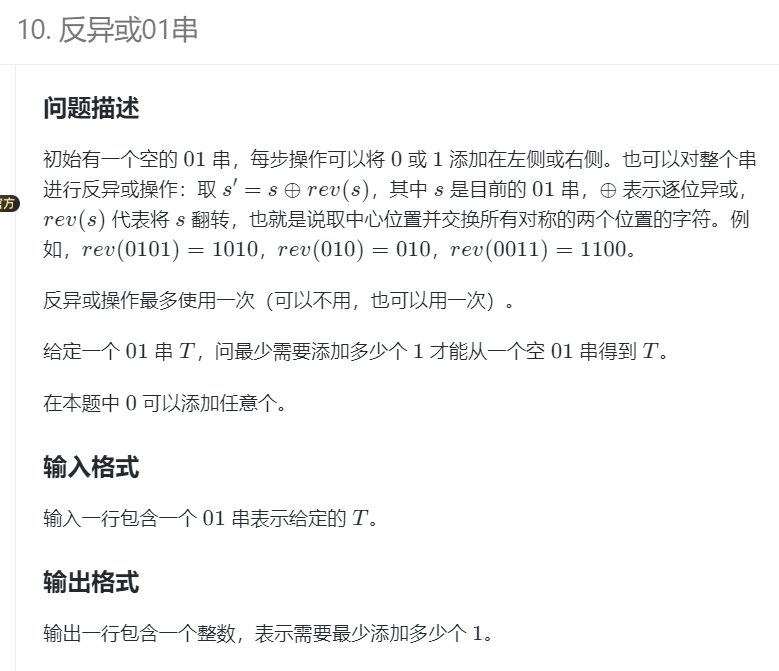

### 23lqb省赛


#### 反异或01串



蓝桥杯2023真题

思维、回文串、马拉车

本题暴力拿50%

思维难度大

https://www.lanqiao.cn/problems/5003/learning/?subject_code=2&group_code=6&match_num=14&match_flow=1&origin=cup

```
import java.util.*;

public class Main {
    static int INF = 0x3f3f3f3f;
    static int n,m;
    static long ans;
    
    public static void main(String[] args) {
        Scanner sc = new Scanner(System.in);
        //思维 + 回文字符串，正解是马拉车算法
    //思考反转异或操作有什么用？
    //如 0001，反转异或后变成1001，也就是1翻倍了，从而让初始少了1个1
    //此外，反转异或后s':变成了回文串了
    //所以，只要找到T中回文子串的最大1的个数cnt2，cnt2/2就是省去的个数
    //ans = cnt1 / (cnt2/2), cnt1是T中1的个数
    //注意：如果是奇数子串，中心必须是'0'才进行讨论
    //异或：相异得1，所以只要1个1就能变成2个1
    //反转：要求s'回文
        char[] t = sc.next().toCharArray();
    n = t.length;
    int mx = 0,s = 0;
        //计算所有回文子串中1的个数的最大值
    for(int i=0;i<n;i++){//枚举中心
      //奇数长度子串
      int cnt = 0;
      if(t[i]=='0'){
        for(int j=1;i-j>=0 && i+j<n;j++){
          if(t[i-j]!=t[i+j])
            break;
          if(t[i-j]=='1') cnt ++;
        }
        mx = Math.max(mx,cnt);
      }
        
      //偶数长度,右中心
      cnt = 0;
      for(int j=i-1,k=i;j>=0 && k<n;j-=1,k+=1){
          if(t[j]!=t[k])
            break;
          if(t[j]=='1') cnt ++;
        }
      mx = Math.max(mx,cnt);
      
      if(t[i]=='1') s += 1;
    }
    
    System.out.println(s - mx);
    }
}
```


#### 互质数的个数


https://www.lanqiao.cn/problems/3522/learning/?subject_code=2&group_code=6&match_num=14&match_flow=1&origin=cup

本题比赛时候写了欧拉函数，但是还是拿的暴力分，因为不能直接对a^b求快速幂，因为Mod是对方案个数求模，而不是对值求模。

正确答案：ans = Euler(a)  * qpow(a,b-1,Mod)


Eular(a^b) = a^b * ( /p*(p-1) ......)  = a^(b-1)  * Eular(a)

推导：Eular(a^b) = Eular(a * a^(b-1)) = a

```
MOD = 998244353

a, b = map(int, input().split())
if a == 1:
    print(0)
    exit(0)

def qpow(x, n):
    res = 1
    while n:
        if n & 1:
            res = res * x % MOD
        x = x * x % MOD
        n >>= 1
    return res

def euler(x):
    res = x
    for i in range(2, int(x ** 0.5) + 1):
        if x % i == 0:
            while x % i == 0:
                x //= i
            res = res // i * (i - 1)
    if x > 1:
        res = res // x * (x - 1)
    return res

print(qpow(a, b - 1) * euler(a) % MOD)
```


#### 小蓝的旅游计划


> https://www.lanqiao.cn/problems/3534/learning/?subject_code=2&group_code=5&match_num=14&match_flow=1&origin=cup
>
> 本题可以用dp做，时间O（n^3）
>
> 用堆做
>
> 如果没有油箱的限制，是一道经典的堆的题目，
>
> 有了邮箱的限制，需要再多一维，维护来的时候的油箱容量。

方法1：堆+线段树

https://blog.csdn.net/m0_62573287/article/details/130428871

方法2：堆

维护的Node包含三个信息：

//price这个地点的油价格
  //l：这个地点还能加这么多油
  //prem：刚到达这个节点时的油量（不算这个地方加的油），这个变量目的是因为油箱上限是m。

```
import java.util.*;
import java.io.*;
import java.math.*;

public class Main {
	static int INF = 0x3f3f3f3f;
	static int N = 201000,M = 2*N;
	static int n,m;
	static long ans;
  static int[] dist = new int[N],cost = new int[N],lost = new int[N];
	
	public static void main(String[] args) {
		Scanner sc = new Scanner(System.in);
		
		n = sc.nextInt();
		m = sc.nextInt();
		for(int i=1;i<=n;i++) {
			dist[i] = sc.nextInt();
      cost[i] = sc.nextInt();
      lost[i] = sc.nextInt();
		}
    PriorityQueue<Node> q = new PriorityQueue<Node>((a,b)->(a.price-b.price));
    int curm = m;//油箱打小
    
    for(int i=1;i<=n;i++){
      if(dist[i]>m){
        System.out.println("-1");
        return;
      }

      //当前油量不够到达i,再买一点油
      while (q.size()>0 && curm<dist[i]){
        //买油
        Node t = q.poll();
        //这个节点能买到最多这么多油，m-剩下的油
        int now_mx_m = Math.min(t.l,m-t.prem);
        //当前需要加多少油
        int add_m = 0;
        //够节点i用了，选择部分。否则全选
        if(now_mx_m >= dist[i]-curm)
          add_m = dist[i]-curm;
        else add_m = now_mx_m;
        ans += (long)add_m * t.price;
        t.l -= add_m;
        curm += add_m;
        if(t.l>0){
          q.add(new Node(t.price,t.l,t.prem));
        }
      }
      //现在油够用了
      curm -= dist[i];
      q.add(new Node(cost[i],lost[i],curm));
    }
    System.out.println(ans);
    
	}
}
class Node{
  //price这个地点的油价格
  //l：这个地点还能加这么多油
  //prem：刚到达这个节点时的油量（不算这个地方加的油），这个变量目的是因为油箱上限是m。
  int price,l,prem;
  Node(int a,int b,int c){
    price = a;
    l = b;
    prem = c;
  }
}
```


#### 阶乘的和


https://www.lanqiao.cn/problems/3527/learning/?subject_code=2&group_code=5&match_num=14&match_flow=1&origin=cup&page=1

数学、思维

4个3！才能凑出4!。

8个3！也能凑出4！。

```
import java.util.*;
import java.io.*;
import java.math.*;

public class Main {
	static int INF = 0x3f3f3f3f;
	static int N = 101000,M = 2*N;
	static int[] arr = new int[N];
	static int n,m;
	static long ans;
	//首先找到mi = min(arr)，因为是公因数,一定 m>=mi
  //然后从mi开始枚举，知道找不到为止
  //具体的，当mi = 3时，当a中3的个数有4个才能凑出4。4*3！== 4！
	public static void main(String[] args) {
		Scanner sc = new Scanner(System.in);
		
		n = sc.nextInt();
    int mi = INF;
    HashMap<Integer,Integer> mp = new HashMap<>();
		for(int i=1;i<=n;i++) {
			arr[i] = sc.nextInt();
      mi = Math.min(mi,arr[i]);
      mp.put(arr[i],mp.getOrDefault(arr[i],0)+1);
		}
    int i;
    int jin = 0;//进位
    for(i=mi;;i++){
      int v = mp.getOrDefault(i,0);
      int cnt = v+jin;
      //如果i！的个数能凑出i+1
      if(cnt!=0 && cnt%(i+1)==0){
        jin = (v+jin)/(i+1); //进位贡献
        continue;
      }
      else break;
    }
    System.out.println(i);
	}
}
```


#### 蜗牛


https://www.lanqiao.cn/problems/4985/learning/?page=1&first_category_id=1&second_category_id=3&sort=problem_id&asc=0

状态机dp，感觉题目不严谨，没说X是递增的，也没说坐标会不会是负的


```java
import java.util.*;
import java.io.*;
import java.math.*;

public class Main {
	static int INF = Integer.MAX_VALUE;
	static int N = 101000,M = 2*N;
	static int[] x = new int[N];
  static int[] a = new int[N],b = new int[N];
  static double[][] dp = new double[N][2];
	static int n,m;
	static double ans;
	//状态机
  //dp[i][0]表示节点(i,0)的最小值
  //dp[i][1]表示当前杆子上传送起点位置的最小值：节点(i,a[i])的最小值
  //需要两个状态，所以是状态机，否则就是背包
  //关键点：每个杆子i上有两个点，一个是i-1传送到达点b[i]，一个是传送至i+1的起点a[i]
	public static void main(String[] args) {
		Scanner sc = new Scanner(System.in);
		
		n = sc.nextInt();
		for(int i=1;i<=n;i++) {
			x[i] = sc.nextInt();
		}
    for(int i=1;i<=n-1;i++) {
      a[i] = sc.nextInt();b[i+1] = sc.nextInt();
    }
    //初始没有杆子
    dp[0][1] = INF;
    
    for(int i=1;i<=n;i++) {
      dp[i][0] = Math.min(dp[i-1][0] + x[i]-x[i-1], dp[i-1][1] + b[i]/1.3);
      //在杆子上需要判断是向下还是向上
      dp[i][1] = Math.min(dp[i-1][1] + Math.abs(b[i]-a[i]) /(a[i]>b[i]?0.7:1.3),dp[i-1][0]+x[i]-x[i-1]+a[i]/0.7);
      // System.out.println(i+" "+dp[i][0]);
    }
    System.out.printf("%.2f",dp[n][0]);
	}
}
```


## 爆搜

#### 分糖果


https://www.lanqiao.cn/problems/4124/learning/?page=1&first_category_id=1&second_category_id=3&sort=problem_id&asc=0

```
import java.util.*;
import java.io.*;
import java.math.*;

public class Main {
	static int INF = Integer.MAX_VALUE;
	static int N = 101000,M = 2*N;
	static int n,m;
	static long ans;
	static void dfs(int u,int x,int y){
    if(u>=n){
      if(x==0 && y==0)
        ans += 1;
      return;
    }
    for(int i=0;i<=x;i++){
      for(int j=0;j<=y;j++){
        if(i+j>=2 && i+j<=5)
          dfs(u+1,x-i,y-j);
      }
    }
  }
	public static void main(String[] args) {
		Scanner sc = new Scanner(System.in);
		n = 7;
		dfs(0,9,16);
    System.out.println(ans);
	}
}
```

